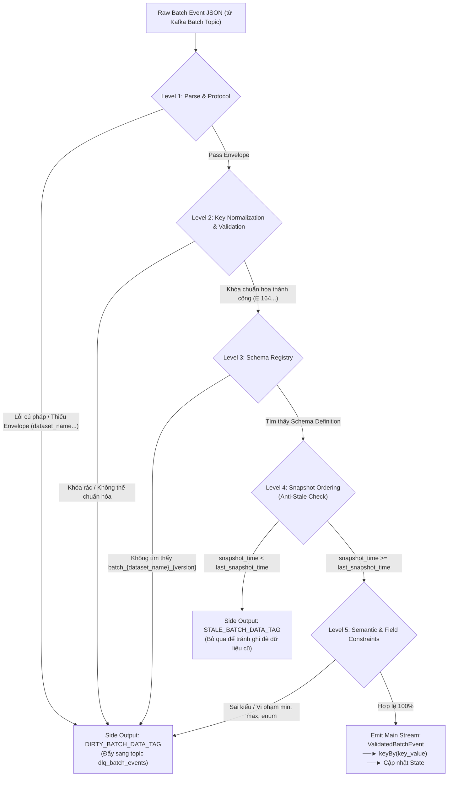

# Đặc Tả Logic Schema & Quy Trình Thẩm Định Batch Event (Batch Event Schema & Validation Spec)

> **Mục đích tài liệu:** Quy định chi tiết cấu trúc dữ liệu, đặc tả schema định dạng chuẩn, cơ chế thẩm định (validation) và quy trình xử lý dữ liệu từ các luồng **Batch Event Topic** (Hive/Spark ETL/DWH/Data Lake) trước khi nạp vào **Keyed State (RocksDB)** trong hệ thống Stateful Streaming Core. Tài liệu đóng vai trò là chuẩn kỹ thuật cho việc triển khai `BatchSchemaValidationFunction` và đảm bảo an toàn trạng thái cho **Bài toán B (Realtime Lookup Batch State)**.

---

## 1. Tổng Quan & Mô Hình

### 1.1. Bản chất thực tế của luồng Batch trong Big Data
Trong các kiến trúc dữ liệu lớn (DWH, Data Lake, Hive, Spark), dữ liệu tầng dưới gồm hàng trăm bảng vật lý (ODS/Staging/L1). Khi các tiến trình ETL định kỳ chạy, hệ thống **không bao giờ đẩy từng bảng vật lý đơn lẻ** vào Kafka, mà luôn thực hiện các câu lệnh SQL phức tạp (**JOIN, AGGREGATE, TRANSFORM**) từ nhiều bảng để tạo ra một **bảng tổng hợp đặc trưng theo chủ thể (Wide Table / Feature Vector / Data Mart)**.

**Ví dụ thực tế câu lệnh Spark/Hive ETL:**
```sql
SELECT 
    cms.ISDN AS msisdn, 
    s.sub_code,
    cms.status,
    cms.start_date,
    cms.end_date
FROM ${L1_SUB_MNGT_SUB_ORDER_REQUEST} sor
JOIN ${L1_SUB_MNGT_CUST_MAP_SUBS} cms ON sor.CUST_MAP_SUB_ID = cms.id
JOIN ${L1_SUB_MNGT_SUB} s             ON cms.SUB_ID = s.id
WHERE cms.status = 1 AND cms.IS_DELETE = 0
  AND s.SUB_CODE IN ('VTM1','VTM2','VTM3','VTM4')
  AND date_format(cms.START_DATE,'yyyyMMdd') <= $[PARTITION_DATE]
  AND date_format(cms.END_DATE,  'yyyyMMdd') >= $[PARTITION_DATE]
```

Trong câu lệnh trên:
* `msisdn`, `status`, `start_date` được lấy từ bảng `L1_SUB_MNGT_CUST_MAP_SUBS` (`cms`).
* `sub_code` được lấy từ bảng `L1_SUB_MNGT_SUB` (`s`).
* Điều kiện liên kết và lọc nằm ở cả 3 bảng `sor`, `cms`, `s`.

👉 **Hạn chế của cách đặt tên `source` và `table_name`:**
Nếu gán bản tin này mang tên `table_name` là `sor` hay `cms` hay `s` thì hoàn toàn không đại diện được bản chất dữ liệu; và nếu gán `source` là tên hệ thống đơn lẻ (như `L1_SUB_MNGT`) thì khi một job ETL join giữa CRM và Billing sẽ không biết thuộc về `source` nào.

### 1.2. Giải pháp: Tổ chức theo Mô hình "Entity - Feature Group"
Hệ thống phân biệt rõ bản chất giữa 2 luồng dữ liệu:
* **Luồng Stream Event (Động từ / Sự kiện phát sinh tức thời):** Gắn với một ứng dụng nguồn cụ thể sinh ra event (`source = CPM` cho giao dịch thanh toán, `source = EVT` cho mobile click stream).
* **Luồng Batch Event (Danh từ / Trạng thái hồ sơ nền tảng):** Gắn với một **Nhóm Đặc Trưng Nghiệp Vụ (`dataset_name` hoặc `feature_group`)** phản ánh mục đích của câu lệnh ETL (ví dụ: `dataset_name: "sub_profile"` cho hồ sơ gói cước thuê bao, `dataset_name: "daily_spending"` cho tổng chi tiêu ngày, `dataset_name: "risk_scoring"` cho điểm rủi ro).

```text
┌────────────────────────────────────────────────────────────────────────┐
│ Spark / Hive Batch ETL Jobs (Join nhiều bảng: sor JOIN cms JOIN s)     │
└───────────────────────────────────┬────────────────────────────────────┘
                                    │ (Đẩy định kỳ theo Feature Group)
                                    ▼
┌────────────────────────────────────────────────────────────────────────┐
│ Kafka Batch Topics (Ví dụ: batch_sub_profile, batch_daily_spending)    │
└───────────────────────────────────┬────────────────────────────────────┘
                                    │
                                    ▼
┌────────────────────────────────────────────────────────────────────────┐
│        BatchSchemaValidationFunction (TẦNG THẨM ĐỊNH)                  │
│  - Tự động chuẩn hóa khóa (Key Normalizer về E.164: +84981234567...)   │
│  - Kiểm tra tính hợp lệ của Envelope & Payload                         │
│  - Chống ghi đè dữ liệu cũ (Anti-Stale / Out-of-Order Snapshot)        │
│  - Lọc dữ liệu bẩn đẩy ra DLQ (dlq_batch_events)                       │
└───────────────────────────────────┬────────────────────────────────────┘
                                    │ (Chỉ dữ liệu hợp lệ)
                                    ▼
                             keyBy(key_value)
                                    │
                                    ▼
┌────────────────────────────────────────────────────────────────────────┐
│     KeyedCoProcessFunction (Stateful Streaming Core)                   │
│  - Cập nhật batchProfileState (RocksDB) theo <dataset_name>.<field>    │
│  - Phục vụ tra cứu cho luồng Realtime Stream (Bài toán B)              │
└────────────────────────────────────────────────────────────────────────┘
```

---

## 2. Cấu Trúc Bản Tin Batch Event (Batch Event Envelope Specification)

Mỗi message gửi vào Kafka Batch Topic gồm 2 phần: **Envelope Header** (Metadata kiểm soát luồng batch) và **Data Payload** (Dữ liệu đặc trưng sau ETL).

### 2.1. Cấu trúc JSON Envelope chuẩn
```json
{
  "dataset_name": "sub_profile",
  "pipeline_id": "HIVE_ETL_SUB_ORDER_REQUEST_DAILY",
  "schema_version": "v1",
  "batch_id": "BATCH_20260921_001",
  "snapshot_time": "2026-09-21T02:30:00.000+07:00",
  "sync_mode": "UPSERT",
  "key_field": "msisdn",
  "key_value": "+84981234567",
  "data": {
    "sub_code": "VTM1",
    "status": 1,
    "start_date": "2024-01-01T00:00:00.000+07:00",
    "end_date": "2026-12-31T23:59:59.000+07:00",
    "package_code": "ST120K",
    "arpu_last_3m": 150000.5
  }
}
```

### 2.2. Bảng đặc tả các trường trong Envelope Header

| Tên trường | Kiểu dữ liệu | Bắt buộc | Mô tả & Ràng buộc kỹ thuật |
| :--- | :--- | :---: | :--- |
| **`dataset_name`** | `STRING` | Có | Định danh nhóm đặc trưng nghiệp vụ sau khi ETL (ví dụ: `sub_profile`, `daily_spending`, `risk_scoring`). Dùng làm namespace lưu State. |
| **`pipeline_id`** | `STRING` | Có | Tên/ID của tác vụ ETL ở DWH/Hive/Spark (ví dụ: `HIVE_ETL_SUB_ORDER_REQUEST_DAILY`). Dùng để audit và truy vết lỗi nguồn. |
| **`schema_version`** | `STRING` | Có | Phiên bản schema dùng để đối soát với Schema Registry (ví dụ: `v1`, `v2`, `1.0.0`). |
| **`batch_id`** | `STRING` | Có | Mã định danh duy nhất của mẻ chạy batch (Job Run ID). Dùng để audit và deduplicate bản ghi trong cùng đợt nạp. |
| **`snapshot_time`** | `STRING` | Có | Mốc thời gian dữ liệu được trích xuất (ISO-8601). **Căn cứ cốt lõi để chống ghi đè dữ liệu cũ (Anti-Stale logic)**. |
| **`sync_mode`** | `STRING` | Có | Chế độ đồng bộ: `FULL_SNAPSHOT`, `UPSERT` hoặc `DELETE` (Xem mục 2.3). |
| **`key_field`** | `STRING` | Có | Tên trường khóa định danh thực thể (mặc định: `"msisdn"` hoặc `"customer_id"`). |
| **`key_value`** | `STRING` | Có | Giá trị khóa định danh. Được kiểm tra theo quy tắc `key_definition` (Với số điện thoại: tự động chuẩn hóa về E.164). |
| **`data`** | `OBJECT` | Có | Chứa toàn bộ các cặp Key-Value đặc trưng nghiệp vụ (Rỗng `{}` nếu `sync_mode = DELETE`). |

### 2.3. Quy ước các chế độ đồng bộ (`sync_mode`)

| Chế độ (`sync_mode`) | Hành vi tương ứng tại Keyed State (RocksDB) | Yêu cầu đối với trường `data` |
| :--- | :--- | :--- |
| **`FULL_SNAPSHOT`** | **Ghi đè hoàn toàn (Overwrite):** Xóa sạch toàn bộ các thuộc tính cũ của riêng `dataset_name` này trong state của khách hàng và nạp mới toàn bộ các trường trong `data`. Các thuộc tính của dataset khác (như `daily_spending`) được **giữ nguyên**. | Bắt buộc chứa đầy đủ tất cả các trường được đánh dấu `required: true`. |
| **`UPSERT` (hoặc `DELTA`)** | **Cập nhật từng phần (Patch/Merge):** Chỉ thêm mới hoặc cập nhật các trường có mặt trong `data`. Các trường đã có từ trước trong dataset này vẫn được **bảo toàn nguyên vẹn**. | Chỉ cần chứa các trường có biến động; không bắt buộc gửi lại toàn bộ trường. |
| **`DELETE`** | **Xóa sạch (Evict):** Xóa toàn bộ trạng thái của khách hàng thuộc `dataset_name` này ra khỏi State. | Khối `data` có thể là `{}` hoặc `null`. |

---

## 3. Cấu Trúc Định Nghĩa Schema Động (Data-Driven Batch Schema Definition)

Các schema định nghĩa cho Batch Event được lưu trữ tập trung tại bảng `schema_definitions` của PostgreSQL và đồng bộ sang Flink qua Kafka topic `schema_registry` nhờ Debezium CDC.

### 3.1. DDL Bảng Lưu Trữ Schema trong PostgreSQL
```sql
-- Đã có trong postgres/init/init.sql
CREATE TABLE IF NOT EXISTS schema_definitions (
    schema_id VARCHAR(255) PRIMARY KEY,      -- Cú pháp: batch_{dataset_name}_{version}, VD: batch_sub_profile_v1
    schema_payload JSONB NOT NULL,            -- Chi tiết cấu trúc validate
    created_at TIMESTAMP NOT NULL DEFAULT CURRENT_TIMESTAMP
);
```

### 3.2. Cấu trúc Chi Tiết của `schema_payload`
Dưới đây là JSON mẫu của Batch Schema cho nhóm đặc trưng `sub_profile` (kết quả từ câu query ETL Join):

```json
{
  "$schema": "https://json-schema.org/draft/2020-12/schema",
  "schema_id": "batch_sub_profile_v1",
  "schema_type": "BATCH",
  "dataset_name": "sub_profile",
  "version": "v1",
  "description": "Hồ sơ thuê bao tổng hợp từ L1_SUB_MNGT_SUB_ORDER_REQUEST, CUST_MAP_SUBS, SUB",
  "ttl_seconds": 2592000,                      // Thời gian giữ State: 30 ngày (0 = vô hạn)
  
  // ĐẶC TẢ KHÓA ĐỊNH DANH LINH HOẠT
  "key_definition": {
    "field": "msisdn",
    "key_type": "PHONE_E164",                  // PHONE_E164 | UUID | ACCOUNT_ID | STRING
    "allow_null": false,
    "auto_normalize": true,                    // Bật tự động chuẩn hóa về E.164
    "default_country_code": "84",              // Mã quốc gia mặc định nếu đầu vào là số nội địa (098...)
    "regex_pattern": "^\\+[1-9][0-9]{6,14}$",  // Chuẩn quốc tế E.164 toàn cầu
    "allowed_country_codes": [                 // Whitelist các thị trường Viettel vận hành (Optional)
      "84", "856", "855", "95", "51", "670", "255", "258", "257", "509"
    ]
  },

  "allowed_sync_modes": ["FULL_SNAPSHOT", "UPSERT", "DELETE"],
  "fields": {
    "sub_code": {
      "type": "STRING",
      "required": true,
      "nullable": false,
      "allowed_values": ["VTM1", "VTM2", "VTM3", "VTM4", "OTHER"],
      "description": "Mã phân loại thuê bao từ bảng L1_SUB_MNGT_SUB"
    },
    "status": {
      "type": "INT",
      "required": true,
      "nullable": false,
      "allowed_values": [0, 1],
      "description": "Trạng thái hoạt động (1: Active, 0: Inactive)"
    },
    "package_code": {
      "type": "STRING",
      "required": false,
      "nullable": true,
      "max_length": 50,
      "description": "Gói cước data chính đang hoạt động"
    },
    "start_date": {
      "type": "TIMESTAMP",
      "required": false,
      "nullable": true,
      "format": "ISO-8601",
      "description": "Ngày bắt đầu hiệu lực hợp đồng thuê bao"
    },
    "end_date": {
      "type": "TIMESTAMP",
      "required": false,
      "nullable": true,
      "format": "ISO-8601",
      "description": "Ngày hết hạn hợp đồng thuê bao"
    },
    "arpu_last_3m": {
      "type": "DOUBLE",
      "required": false,
      "nullable": true,
      "min": 0.0,
      "max": 1000000000.0,
      "default_value": 0.0,
      "description": "Doanh thu trung bình 3 tháng gần nhất (VNĐ)"
    }
  }
}
```

### 3.3. Bảng Đặc Tả Chi Tiết Các Ràng Buộc Của Từng Trường (Field Constraints Specification Table)

> [!NOTE]
> **Các kiểu dữ liệu (`type`) được hỗ trợ:**  **`STRING`**, **`INT`**, **`LONG`**, **`DOUBLE`**, **`BOOLEAN`**, **`TIMESTAMP`**.

Mỗi trường (`field`) trong khối `fields` của Batch Schema được định nghĩa bởi một tập hợp các thuộc tính ràng buộc nhằm kiểm soát tính toàn vẹn của dữ liệu trước khi ghi vào Keyed State. 

Dưới đây là bảng quy chuẩn toàn diện các thuộc tính ràng buộc, logic kiểm tra tương ứng tại Flink (`BatchSchemaValidationFunction`) và mã lỗi kích hoạt đẩy ra DLQ khi vi phạm:

| Thuộc tính ràng buộc (`Constraint Property`) | Kiểu dữ liệu áp dụng (`Applicable Types`) | Kiểu giá trị khai báo (`Config Value Type`) | Ý nghĩa nghiệp vụ & Quy chuẩn | Logic thẩm định tại Flink (Validation Enforcement Trigger) | Mã lỗi kích hoạt ra DLQ (`Error Code`) | Ví dụ khai báo thực tế |
| :--- | :--- | :--- | :--- | :--- | :--- | :--- |
| **`required`** | **Tất cả kiểu** (`ALL`) | `BOOLEAN` | Quy định trường dữ liệu **bắt buộc phải xuất hiện (tồn tại key)** trong khối `data` của bản tin Batch (đặc biệt bắt buộc đối với chế độ `FULL_SNAPSHOT`). | `if (!eventData.has(fieldName))`<br>$\rightarrow$ Kích hoạt lỗi | `ERR_BATCH_MISSING_REQUIRED_FIELD` | `"sub_code": { "type": "STRING", "required": true }`<br>`"status": { "type": "INT", "required": true }` |
| **`nullable`** | **Tất cả kiểu** (`ALL`) | `BOOLEAN` | Quy định trường có được phép mang giá trị `null` (hoặc `JsonNode.isNull()`) hay không khi key đã tồn tại. Mặc định là `true` nếu không khai báo. | `if (eventData.has(fieldName) && eventData.get(fieldName).isNull() && !nullable)`<br>$\rightarrow$ Kích hoạt lỗi | `ERR_BATCH_NULL_NOT_ALLOWED` | `"sub_code": { "nullable": false }`<br>`"status": { "nullable": false }`<br>`"package_code": { "nullable": true }` |
| **`allowed_values`** | `STRING`, `INT`, `LONG` | `ARRAY<T>` | Danh mục các giá trị hợp lệ cố định (**Whitelist / Enum**). Giá trị thực tế bắt buộc phải thuộc danh sách này. | `if (!allowedValues.contains(val))`<br>$\rightarrow$ Kích hoạt lỗi (sử dụng `HashSet` trên RAM để tra cứu $O(1)$) | `ERR_BATCH_ENUM_VIOLATION` | `"sub_code": { "allowed_values": ["VTM1", "VTM2", "VTM3", "VTM4", "OTHER"] }`<br>`"status": { "allowed_values": [0, 1] }` |
| **`min`** | `INT`, `LONG`, `FLOAT`, `DOUBLE`, `TIMESTAMP (EPOCH_MS)` | `NUMBER` | Ngưỡng giá trị số học tối thiểu cho phép ($value \ge min$). Không áp dụng cho chuỗi. | `if (val.asDouble() < min)`<br>$\rightarrow$ Kích hoạt lỗi | `ERR_BATCH_OUT_OF_RANGE` | `"arpu_last_3m": { "type": "DOUBLE", "min": 0.0 }`<br>`"risk_level": { "type": "INT", "min": 0 }` |
| **`max`** | `INT`, `LONG`, `FLOAT`, `DOUBLE`, `TIMESTAMP (EPOCH_MS)` | `NUMBER` | Ngưỡng giá trị số học tối đa cho phép ($value \le max$). Chặn các giá trị số bất thường hoặc tràn bộ nhớ. | `if (val.asDouble() > max)`<br>$\rightarrow$ Kích hoạt lỗi | `ERR_BATCH_OUT_OF_RANGE` | `"arpu_last_3m": { "type": "DOUBLE", "max": 1000000000.0 }`<br>`"risk_level": { "type": "INT", "max": 5 }` |
| **`min_length`** | `STRING` | `INTEGER` | Độ dài chuỗi ký tự tối thiểu ($length \ge min\_length$). Không tính nếu giá trị là `null` hợp lệ. | `if (val.asText().length() < minLength)`<br>$\rightarrow$ Kích hoạt lỗi | `ERR_BATCH_STRING_TOO_SHORT` | `"id_card": { "type": "STRING", "min_length": 9 }` |
| **`max_length`** | `STRING` | `INTEGER` | Độ dài chuỗi ký tự tối đa ($length \le max\_length$). Chống việc gửi chuỗi rác quá dài làm phình to RocksDB State. | `if (val.asText().length() > maxLength)`<br>$\rightarrow$ Kích hoạt lỗi | `ERR_BATCH_STRING_TOO_LONG` | `"package_code": { "type": "STRING", "max_length": 50 }`<br>`"sub_code": { "type": "STRING", "max_length": 20 }` |
| **`format`** | `STRING`, `TIMESTAMP` | `STRING` | Quy chuẩn định dạng ngữ nghĩa mở rộng: `"ISO-8601"`, `"PHONE_E164"`, `"UUID"`, `"ISO_DATE"`, `"EPOCH_MS"`. | Thẩm định theo parser chuyên biệt của từng format (ví dụ: `Instant.parse()` hoặc Regex E.164). Nếu parse thất bại $\rightarrow$ Kích hoạt lỗi | `ERR_BATCH_FORMAT_MISMATCH`<br>hoặc `ERR_BATCH_INVALID_TIMESTAMP` | `"start_date": { "type": "TIMESTAMP", "format": "ISO-8601" }`<br>`"end_date": { "type": "TIMESTAMP", "format": "ISO-8601" }` |
| **`regex_pattern`** | `STRING` | `STRING` | Biểu thức chính quy kiểm tra cấu trúc chuỗi (ví dụ: định dạng mã hợp đồng, số CCCD/Hộ chiếu). | `if (!pattern.matcher(val.asText()).matches())`<br>$\rightarrow$ Kích hoạt lỗi (Pre-compiled `java.util.regex.Pattern`) | `ERR_BATCH_PATTERN_MISMATCH` | `"contract_no": { "regex_pattern": "^HD_[0-9]{8}$" }` |
| **`default_value`** | `INT`, `LONG`, `DOUBLE`, `STRING`, `BOOLEAN` | Giá trị cùng kiểu `type` | Giá trị mặc định được tự động điền vào State nếu bản tin không chứa trường này (trong chế độ `UPSERT` / `DELTA`). | `if (!eventData.has(fieldName)) { val = defaultValue; }`<br>$\rightarrow$ Tự động gán giá trị mặc định | Không bắn lỗi (Auto-fill) | `"arpu_last_3m": { "type": "DOUBLE", "default_value": 0.0 }`<br>`"is_vip": { "type": "BOOLEAN", "default_value": false }` |
| **`description`** | **Tất cả kiểu** (`ALL`) | `STRING` | Chú thích ý nghĩa nghiệp vụ của trường dữ liệu, giúp người viết Rule hiểu đúng bản chất trường. | Không tham gia thẩm định (Metadata only) | Không bắn lỗi | `"sub_code": { "description": "Mã phân loại thuê bao từ bảng L1_SUB_MNGT_SUB" }` |
---

## 4. Quy Trình Thẩm Định Batch Event Chi Tiết (5-Level Validation Pipeline)

Khi một bản tin Batch Event đi vào toán tử `BatchSchemaValidationFunction`, nó phải trải qua tuần tự **5 tầng thẩm định** trước khi được phát hành sang bước `keyBy(key_value)`.



### 4.1. Level 1: Protocol & Envelope Validation
1. **JSON Syntax:** Parse chuỗi bản tin bằng Jackson `ObjectMapper`. Nếu lỗi $\rightarrow$ Gắn mã `ERR_BATCH_JSON_MALFORMED`, đẩy vào DLQ.
2. **Envelope Fields:** Kiểm tra sự hiện diện của các trường metadata bắt buộc:
   - `dataset_name`, `pipeline_id`, `schema_version`, `batch_id`, `snapshot_time`, `sync_mode`, `key_value`.
   - Nếu thiếu bất kỳ trường nào $\rightarrow$ Gắn mã `ERR_BATCH_MISSING_ENVELOPE`.
3. **Sync Mode:** Giá trị `sync_mode` phải thuộc danh sách `["FULL_SNAPSHOT", "UPSERT", "DELETE"]`.

### 4.2. Level 2: Partition Key Normalization & Validation
- **Bước 2.1 (Tự động chuẩn hóa số điện thoại):**
  - Làm sạch ký tự lạ (loại bỏ khoảng trắng, dấu ngoặc, dấu chấm, dấu gạch ngang).
  - Nếu đầu vào là số nội địa (bắt đầu bằng `0`, ví dụ `0981234567`) $\rightarrow$ Tự động chuyển thành định dạng quốc tế E.164: `+` + `default_country_code` + số thuê bao $\rightarrow$ `+84981234567`.
  - Nếu số bắt đầu bằng `84` không có `+` $\rightarrow$ Tự động thêm `+` thành `+84981234567`.
- **Bước 2.2 (Thẩm định định dạng):**
  - Kiểm tra chuỗi đã chuẩn hóa với Regex chuẩn E.164: `^\+[1-9][0-9]{6,14}$`.
  - Nếu có cấu hình `allowed_country_codes`, đối chiếu tiền tố mã quốc gia.
  - Sau khi chuẩn hóa thành công, **ghi đè giá trị chuẩn này vào `key_value`** của bản tin. Nếu thất bại $\rightarrow$ Gắn lỗi `ERR_BATCH_INVALID_KEY_FORMAT`.

### 4.3. Level 3: Schema Registry Lookup (Broadcast State)
- Ghép khóa định danh:
  $$\text{schemaKey} = \text{"batch\_"} + \text{Envelope.dataset\_name} + \text{"\_"} + \text{Envelope.schema\_version}$$
  *(Ví dụ: `batch_sub_profile_v1`)*.
- Tra cứu trực tiếp từ Flink Broadcast State (`SCHEMA_STATE_DESCRIPTOR`).
- Nếu không tìm thấy $\rightarrow$ Gắn mã `ERR_BATCH_SCHEMA_NOT_FOUND`, đẩy vào DLQ.

### 4.4. Level 4: Anti-Stale & Snapshot Ordering Validation
- Tránh tình trạng job ETL chạy lại mẻ dữ liệu cũ ghi đè lên dữ liệu mới trong RocksDB:
  $$\text{last\_snapshot\_time}[\text{dataset\_name}]$$
- Nếu `Envelope.snapshot_time < last_snapshot_time[dataset_name]`:
  - Bản tin là dữ liệu lỗi thời $\rightarrow$ KHÔNG cập nhật State, chuyển sang Side Output `STALE_BATCH_DATA_TAG`.
- Nếu `Envelope.snapshot_time >= last_snapshot_time[dataset_name]`:
  - Hợp lệ, cập nhật mốc thời gian snapshot mới và tiếp tục.

### 4.5. Level 5: Semantic & Field Constraints Validation
Duyệt qua các trường trong khối `data` đối chiếu với danh mục `fields` trong Schema:
- **Kiểm tra trường bắt buộc (`required`):** Đối với `FULL_SNAPSHOT`, mọi trường có `required: true` phải có mặt và không `null`.
- **Kiểm tra kiểu dữ liệu (`type`):** `INT`, `LONG`, `FLOAT`, `DOUBLE`, `STRING`, `BOOLEAN`, `TIMESTAMP`, `OBJECT`, `ARRAY`.
- **Kiểm tra ràng buộc:** `min`, `max`, `allowed_values` (whitelist), độ dài chuỗi, định dạng ISO-8601.

---

## 5. Thiết Kế Lưu Trữ State Trong RocksDB (Namespace `<dataset_name>.<field_name>`)

### 5.1. Cấu Trúc Bảng MapState Theo Khách Hàng
Khi bản tin Batch Event vượt qua khâu validate và đi qua `keyBy(key_value)`, hệ thống lưu trữ các trường vào `batchProfileState` (Keyed MapState) gắn với khách hàng đó.

Toàn bộ các trường được gắn namespace theo định dạng: **`<dataset_name>.<field_name>`**:

```text
┌─────────────────────────────────────────────────────────────────────────────┐
│                    RocksDB Keyed State: batchProfileState                   │
│                        (Keyed by: key_value, vd: +84981234567)              │
├────────────────────────────────┬────────────────────────────────────────────┤
│ Sub-Key (Namespace:FieldName)  │ Ý nghĩa & Nguồn dữ liệu                    │
├────────────────────────────────┼────────────────────────────────────────────┤
│ "_meta:sub_profile:snapshot_ts"│ 1789958400000 (Mốc thời gian snapshot)     │
│ "_meta:sub_profile:pipeline_id"│ "HIVE_ETL_SUB_ORDER_REQUEST_DAILY"         │
│ "sub_profile.sub_code"         │ "VTM1" (Từ kết quả join 3 bảng của bạn)    │
│ "sub_profile.status"           │ 1                                          │
│ "sub_profile.start_date"       │ "2024-01-01T00:00:00.000+07:00"            │
│ "sub_profile.package_code"     │ "ST120K"                                   │
│                                │                                            │
│ "_meta:daily_spending:snapshot_ts"│ 1789958400000                          │
│ "daily_spending.total_vnd"     │ 12500000.0 (Từ job ETL TDH)                │
│ "daily_spending.trans_count"   │ 4                                          │
│                                │                                            │
│ "risk_scoring.fraud_score"     │ 12.5 (Từ job Machine Learning Offline)     │
│ "risk_scoring.is_blacklisted"  │ false                                      │
└────────────────────────────────┴────────────────────────────────────────────┘
```

### 5.2. Tại sao cần tiền tố `<dataset_name>.` mà không lưu phẳng (Flat)?
1. **Chống đụng độ tên trường (Collision Avoidance):** Cả hai dataset `sub_profile` và `bank_account` đều có thể chứa trường tên là `status`. Tiền tố `sub_profile.status` và `bank_account.status` giúp phân biệt chính xác.
2. **Quản lý vòng đời độc lập (Independent Lifecycle / Full Snapshot Eviction):** Khi dataset `sub_profile` chạy `FULL_SNAPSHOT`, Flink chỉ quét và xóa các sub-key bắt đầu bằng `sub_profile.*` mà **không làm mất** dữ liệu của `daily_spending.*` hay `risk_scoring.*`.

### 5.3. Thuật Toán Cập Nhật State Theo `dataset_name`
### 5.3. Thuật Toán Cập Nhật State Theo `dataset_name` (Schema-Driven Point Updates)
Nhờ tận dụng danh sách trường đã được nạp trên RAM từ Schema Registry, quá trình cập nhật không cần gọi `state.keys()` để quét đĩa:

```java
public void updateBatchState(ValidatedBatchEvent event, MapState<String, Object> state) throws Exception {
public void updateBatchState(ValidatedBatchEvent event, 
                             MapState<String, Object> state, 
                             BatchSchemaDefinition schema) throws Exception {
    String dataset = event.getDatasetName();
    String prefix = dataset + ".";
    String metaPrefix = "_meta:" + dataset + ":";

    // 1. Kiểm tra Anti-Stale
    // 1. Kiểm tra Anti-Stale (Level 4)
    Long lastSnapshotTime = (Long) state.get(metaPrefix + "snapshot_ts");
    long currentSnapshotTime = event.getSnapshotTimestampMillis();

    if (lastSnapshotTime != null && currentSnapshotTime < lastSnapshotTime) {
        // Bản tin lỗi thời -> bỏ qua
        // Bản tin lỗi thời -> bỏ qua để tránh ghi đè dữ liệu mới
        return;
    }

    // 2. Cập nhật theo Sync Mode
    switch (event.getSyncMode()) {
        case "FULL_SNAPSHOT":
            // Xóa sạch chỉ các trường thuộc dataset này
            List<String> keysToRemove = new ArrayList<>();
            for (String key : state.keys()) {
                if (key.startsWith(prefix)) {
                    keysToRemove.add(key);
            // Duyệt danh mục trường từ Schema đã có sẵn trong RAM (chỉ 5-15 trường):
            // Không quét đĩa RocksDB, chỉ thực hiện point put / point remove trực tiếp!
            for (String fieldName : schema.getFieldNames()) {
                String stateKey = prefix + fieldName;
                if (event.getData().containsKey(fieldName)) {
                    state.put(stateKey, event.getData().get(fieldName));
                } else {
                    state.remove(stateKey); // Trường cũ không còn trong snapshot -> xóa
                }
            }
            for (String key : keysToRemove) {
                state.remove(key);
            }
            // Ghi mới toàn bộ dữ liệu từ payload
            for (Map.Entry<String, Object> entry : event.getData().entrySet()) {
                state.put(prefix + entry.getKey(), entry.getValue());
            }
            break;

        case "UPSERT":
            // Chỉ cập nhật hoặc ghi đè các trường có trong bản tin
            for (Map.Entry<String, Object> entry : event.getData().entrySet()) {
                state.put(prefix + entry.getKey(), entry.getValue());
            }
            break;

        case "DELETE":
            // Xóa toàn bộ trường của dataset này
            List<String> allDatasetKeys = new ArrayList<>();
            for (String key : state.keys()) {
                if (key.startsWith(prefix) || key.startsWith(metaPrefix)) {
                    allDatasetKeys.add(key);
                }
            // Xóa toàn bộ trường thuộc schema của dataset này
            for (String fieldName : schema.getFieldNames()) {
                state.remove(prefix + fieldName);
            }
            for (String key : allDatasetKeys) {
                state.remove(key);
            }
            state.remove(metaPrefix + "snapshot_ts");
            state.remove(metaPrefix + "pipeline_id");
            state.remove(metaPrefix + "batch_id");
            state.remove(metaPrefix + "updated_at");
            return;
    }

    // 3. Cập nhật Metadata quản lý
    // 3. Cập nhật Metadata quản lý (Bao gồm batch_id phục vụ Epoch Matching)
    state.put(metaPrefix + "snapshot_ts", currentSnapshotTime);
    state.put(metaPrefix + "pipeline_id", event.getPipelineId());
    state.put(metaPrefix + "batch_id", event.getBatchId());
    state.put(metaPrefix + "batch_id", event.getBatchId()); // Snapshot Epoch
    state.put(metaPrefix + "updated_at", System.currentTimeMillis());
}
```

### 5.4. Cơ Chế Snapshot Epoch & Active Batch ID Chống "Trạng Thái Ma" (Ghost State Prevention)

#### Vấn đề "Trạng thái ma" trong luồng Batch:
Trong thực tế, các câu lệnh SQL ETL tại DWH thường chỉ trả về danh sách các thuê bao **thỏa mãn điều kiện** (Positive Matches / `WHERE cms.STATUS = 1 ...`). 
- Nếu hôm nay khách hàng A thỏa mãn $\rightarrow$ Dữ liệu của A được đẩy vào Kafka và lưu vào State.
- Nếu ngày mai khách hàng A **hết hạn hoặc bị hủy gói** $\rightarrow$ Câu SQL ngày mai không trả về A nữa $\rightarrow$ **Kafka không có message nào của A**.
- Vì Flink là hệ thống hướng sự kiện, nếu không nhận được message của A, Flink sẽ **giữ nguyên State cũ của A từ hôm qua**, dẫn đến việc Rule Engine đánh giá sai lệch nghiêm trọng!

#### Giải pháp "Snapshot Epoch / Active Batch ID":
Thay vì bắt ETL phải chạy các phép `FULL OUTER JOIN` đắt đỏ để tìm những ai bị loại ra rồi gửi message `DELETE`, Flink giải quyết triệt để vấn đề này bằng cơ chế **Đối soát Epoch mẻ chạy**:

```text
[Mỗi bản tin Batch mang batch_id] (Ví dụ: batch_id = "20260921")
                 │
                 ▼
[Ghi nhận vào State của Khách hàng]
  _meta:sub_profile:batch_id = "20260921"
                 │
                 ▼
[Flink theo dõi mẻ đang kích hoạt: active_batch_id = "20260921"]
                 │
                 ▼
[Khi Luồng Stream Đánh Giá Rule]
  Điều kiện tiên quyết: State._meta:sub_profile:batch_id == active_batch_id ?
        │
        ├── ĐÚNG (Trùng mẻ 20260921) ──► Khách hàng có trong mẻ hôm nay ──► Đánh giá tiếp các trường
        │
        └── SAI (Vẫn là mẻ 20260920)  ──► Khách hàng đã bị loại khỏi mẻ mới ──► FAIL RULE NGAY LẬP TỨC!
```

1. **Quản lý mẻ kích hoạt (`active_batch_id`):**
   - Flink theo dõi `active_batch_id` của từng `dataset_name` thông qua `BroadcastState` (hoặc tự động cập nhật mốc `batch_id` mới nhất).
2. **Kiểm tra hợp lệ tại thời điểm đánh giá Rule (Zero False Positives):**
   - Trước khi thẩm định giá trị của bất kỳ trường nào trong `sub_profile.*`, Rule Engine đối chiếu `State._meta:sub_profile:batch_id` với `active_batch_id`.
   - Khách hàng không có mặt trong đợt nạp hôm nay sẽ vẫn mang `batch_id` của ngày hôm qua $\rightarrow$ Bị đánh rớt ngay lập tức, triệt tiêu $100\%$ rủi ro đọc phải "trạng thái ma"!
3. **Tự động dọn dẹp đĩa bằng RocksDB State TTL:**
   - Cấu hình RocksDB State TTL cho `batchProfileState` là **36 giờ** (lớn hơn chu kỳ batch 24h một khoảng đệm an toàn):
     ```java
     StateTtlConfig ttlConfig = StateTtlConfig
         .newBuilder(Time.hours(36))
         .setUpdateType(StateTtlConfig.UpdateType.OnCreateAndWrite)
         .setStateVisibility(StateTtlConfig.StateVisibility.NeverReturnExpired)
         .cleanupInRocksdbCompactFilter(1000)
         .build();
     ```
   - Sau 36 giờ không có ai "refresh", State cũ của khách hàng bị loại sẽ **tự động được RocksDB xóa vĩnh viễn trong quá trình Background Compaction** mà không tốn một lệnh xóa thủ công nào.

---

## 6. Cơ Chế Tra Cứu Trực Tiếp từ Rule Engine (Bài toán B)

Khi người dùng cấu hình Rule trong `04_RULE_SCHEMA.md` để kết hợp dữ liệu Realtime Stream và State Batch:

```json
{
  "rule_id": "rule_vtm_high_value_transaction",
  "rule_name": "canh_bao_thue_bao_vtm_giao_dich_lon",
  "condition_tree": {
    "type": "AND",
    "children": [
      {
        // 1. Kiểm tra sự kiện Realtime phát sinh từ luồng CPM (Tiền tố: CPM)
        "type": "CONDITION",
        "expression": {
          "field": "CPM.amount",
          "op": ">=",
          "value": 5000000.0
        }
      },
      {
        // 2. Tra cứu Batch State từ hồ sơ thuê bao sau ETL (Tiền tố: sub_profile)
        "type": "CONDITION",
        "expression": {
          "field": "sub_profile.sub_code",
          "op": "IN",
          "value": ["VTM1", "VTM2", "VTM3", "VTM4"]
        }
      },
      {
        // 3. Tra cứu Batch State từ lịch sử chi tiêu ngày (Tiền tố: daily_spending)
        "type": "CONDITION",
        "expression": {
          "field": "daily_spending.total_vnd",
          "op": ">",
          "value": 10000000.0
        }
      }
    ]
  }
}
```

### Cơ chế thực thi $O(1)$ tại Flink Runtime:
Khi event thanh toán từ `CPM` đến:
1. `CPM.amount` $\rightarrow$ Trùng với stream hiện tại $\rightarrow$ Trích xuất trực tiếp từ payload JSON của event.
2. `sub_profile.sub_code` $\rightarrow$ Tiền tố `sub_profile` khác với stream hiện tại $\rightarrow$ Engine nhận biết đây là trường Batch $\rightarrow$ Gọi `batchProfileState.get("sub_profile.sub_code")` để lấy giá trị ra so sánh.
3. `daily_spending.total_vnd` $\rightarrow$ Gọi `batchProfileState.get("daily_spending.total_vnd")`.
2. **Kiểm tra Snapshot Epoch (Chống Ghost State):**
   - Engine đọc `batchProfileState.get("_meta:sub_profile:batch_id")`.
   - Nếu `batch_id != active_batch_id["sub_profile"]` $\rightarrow$ Khách hàng không nằm trong mẻ hôm nay $\rightarrow$ Đánh rớt điều kiện batch ngay lập tức (FAIL), dừng thẩm định nhánh này.
3. **Thẩm định giá trị trường ($O(1)$ lookup):**
   - Nếu Epoch hợp lệ: gọi `batchProfileState.get("sub_profile.sub_code")` để so sánh với `["VTM1", "VTM2", "VTM3", "VTM4"]`.
   - Gọi `batchProfileState.get("daily_spending.total_vnd")` để so sánh `> 10000000.0`.

👉 **Kết quả:** Quá trình tra cứu hoàn toàn trực tiếp, không cần bất kỳ bộ Mapper hay AST Rewriter nào, tối ưu hóa $100\%$ CPU và RAM.
👉 **Kết quả:** Quá trình tra cứu hoàn toàn trực tiếp $O(1)$, không cần bất kỳ bộ Mapper hay AST Rewriter nào, loại bỏ $100\%$ lỗi Ghost State mà không tốn công quét đĩa.

---

## 7. Danh Mục Mã Lỗi & Dead-Letter Queue (DLQ)

Mọi bản tin vi phạm validation đều được chuyển hướng sang side output `DIRTY_BATCH_DATA_TAG` để sink vào topic `dlq_batch_events`.

### 7.1. Bảng Tra Cứu Mã Lỗi Chuẩn Hóa

| Mã lỗi (Error Code) | Tầng phát hiện | Ý nghĩa | Hành động khắc phục |
| :--- | :---: | :--- | :--- |
| `ERR_BATCH_JSON_MALFORMED` | Level 1 | Chuỗi message không parse được thành JSON. | Kiểm tra serialization ở Producer/Kafka Connect. |
| `ERR_BATCH_MISSING_ENVELOPE` | Level 1 | Thiếu trường bắt buộc (`dataset_name`, `snapshot_time`...). | Bổ sung envelope wrapper ở tác vụ ETL đẩy batch. |
| `ERR_BATCH_INVALID_SYNC_MODE` | Level 1 | Giá trị `sync_mode` không hợp lệ. | Cấu hình đúng `FULL_SNAPSHOT`, `UPSERT`, `DELETE`. |
| `ERR_BATCH_INVALID_KEY_FORMAT` | Level 2 | Khóa sai định dạng hoặc không thể chuẩn hóa về E.164. | Chuẩn hóa số điện thoại ở nguồn ETL trước khi gửi. |
| `ERR_BATCH_SCHEMA_NOT_FOUND` | Level 3 | Không tìm thấy schema `batch_{dataset_name}_{version}`. | Đăng ký schema vào bảng `schema_definitions`. |
| `ERR_BATCH_STALE_SNAPSHOT` | Level 4 | Mốc `snapshot_time` cũ hơn dữ liệu đã có trong State. | Kiểm tra thứ tự nạp các mẻ batch từ DWH. |
| `ERR_BATCH_MISSING_REQUIRED_FIELD` | Level 5 | Thiếu trường bắt buộc có cờ `required=true` trong `FULL_SNAPSHOT`. | Bổ sung cột bị thiếu từ câu lệnh SQL ETL. |
| `ERR_BATCH_TYPE_MISMATCH` | Level 5 | Kiểu dữ liệu thực tế không khớp khai báo (vd: chuỗi thay vì số). | Kiểm tra kiểu dữ liệu trong câu SELECT của job ETL. |
| `ERR_BATCH_OUT_OF_RANGE` | Level 5 | Giá trị số vượt ngưỡng `min` hoặc `max`. | Đối chiếu logic dữ liệu nguồn. |
| `ERR_BATCH_ENUM_VIOLATION` | Level 5 | Giá trị chuỗi không nằm trong `allowed_values`. | Cập nhật thêm enum mới vào schema hoặc lọc bỏ bản ghi rác. |
| `ERR_BATCH_INVALID_TIMESTAMP` | Level 5 | Chuỗi timestamp không parse được theo ISO-8601. | Chuyển đổi định dạng ngày giờ sang chuẩn ISO-8601. |

### 7.2. Cấu Trúc Bản Tin Đẩy Vào DLQ Topic (`dlq_batch_events`)
```json
{
  "error_code": "ERR_BATCH_TYPE_MISMATCH",
  "error_reason": "Field 'status' expects INT but got STRING: 'ACTIVE'",
  "failed_fields": ["status"],
  "failed_stage": "LEVEL_5_FIELD_CONSTRAINT",
  "validated_at": "2026-09-21T09:20:00.123+07:00",
  "source_topic": "batch_sub_profile",
  "raw_payload": {
    "dataset_name": "sub_profile",
    "pipeline_id": "HIVE_ETL_SUB_ORDER_REQUEST_DAILY",
    "schema_version": "v1",
    "batch_id": "BATCH_20260921_001",
    "snapshot_time": "2026-09-21T02:30:00.000+07:00",
    "sync_mode": "UPSERT",
    "key_field": "msisdn",
    "key_value": "+84981234567",
    "data": {
      "sub_code": "VTM1",
      "status": "ACTIVE"
    }
  }
}
```

---

## 8. Ví Dụ Cụ Thể Cho 3 Nhóm Đặc Trưng Batch Tiêu Biểu

### 8.1. Nhóm 1: Hồ sơ thuê bao (`sub_profile`)
- **Nguồn dữ liệu:** Kết quả câu SQL Join giữa `sor`, `cms`, `s` từ DWH.
- **Topic Kafka:** `batch_sub_profile`
- **Khóa định danh:** `msisdn` (chuẩn E.164, ví dụ `+84981234567`).
- **Chế độ đồng bộ:** `UPSERT` hoặc `FULL_SNAPSHOT`.
- **Trường chính:** `sub_code` (`STRING`), `status` (`INT`), `start_date` (`TIMESTAMP`), `package_code` (`STRING`).

### 8.2. Nhóm 2: Lịch sử chi tiêu ngày (`daily_spending`)
- **Nguồn dữ liệu:** Kết quả tổng hợp ngày từ bảng giao dịch `trans_daily_his` (TDH).
- **Topic Kafka:** `batch_daily_spending`
- **Khóa định danh:** `msisdn`.
- **Chế độ đồng bộ:** `UPSERT`.
- **Trường chính:** `total_vnd` (`DOUBLE`), `trans_count` (`INT`), `credit_limit_vnd` (`DOUBLE`).

### 8.3. Nhóm 3: Điểm rủi ro & Danh sách đen (`risk_scoring`)
- **Nguồn dữ liệu:** Mô hình Machine Learning chấm điểm rủi ro và phát hiện gian lận chạy định kỳ.
- **Topic Kafka:** `batch_risk_scoring`
- **Khóa định danh:** `msisdn`.
- **Chế độ đồng bộ:** `UPSERT`.
- **Trường chính:** `fraud_score` (`DOUBLE`), `is_blacklisted` (`BOOLEAN`), `credit_score` (`INT`).

---

## 9. Tóm Tắt & Hướng Dẫn Triển Khai Code

Khi triển khai code trong Phase 2 (thuộc phân công công việc của bạn Thịnh):
1. **Model POJO (`ValidatedBatchEvent`):** Chứa các thuộc tính envelope mới: `datasetName`, `pipelineId`, `schemaVersion`, `batchId`, `snapshotTime`, `syncMode`, `keyField`, `keyValue`, `data`.
2. **`KeyNormalizer`:** Utility tự động chuyển đổi số điện thoại về chuẩn E.164 trước khi validate.
3. **`BatchSchemaValidationFunction`:** 
   - Tra cứu schema theo key: `batch_{datasetName}_{schemaVersion}`.
   - Thẩm định 5 tầng tuần tự: Protocol $\rightarrow$ Key Normalizer $\rightarrow$ Schema Registry $\rightarrow$ Anti-Stale $\rightarrow$ Field Constraints.
4. **Keyed State Update trong CoProcess:**
   - Sử dụng tiền tố `<dataset_name>.<field_name>` khi lưu vào `batchProfileState`.
   - Xử lý xóa chính xác theo prefix khi gặp `FULL_SNAPSHOT` hoặc `DELETE`.
