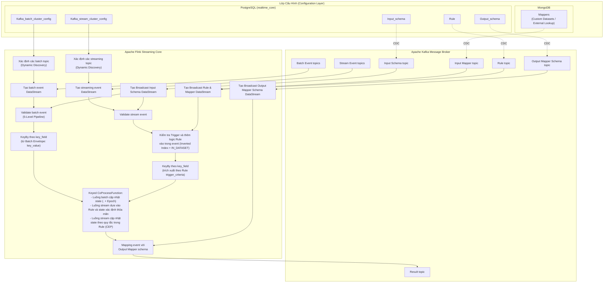
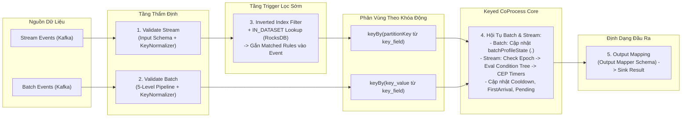
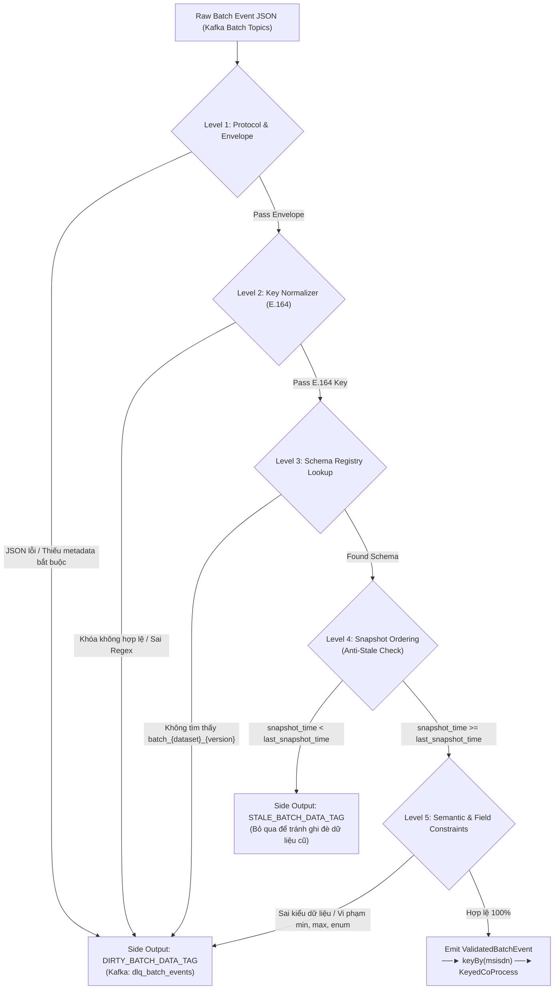
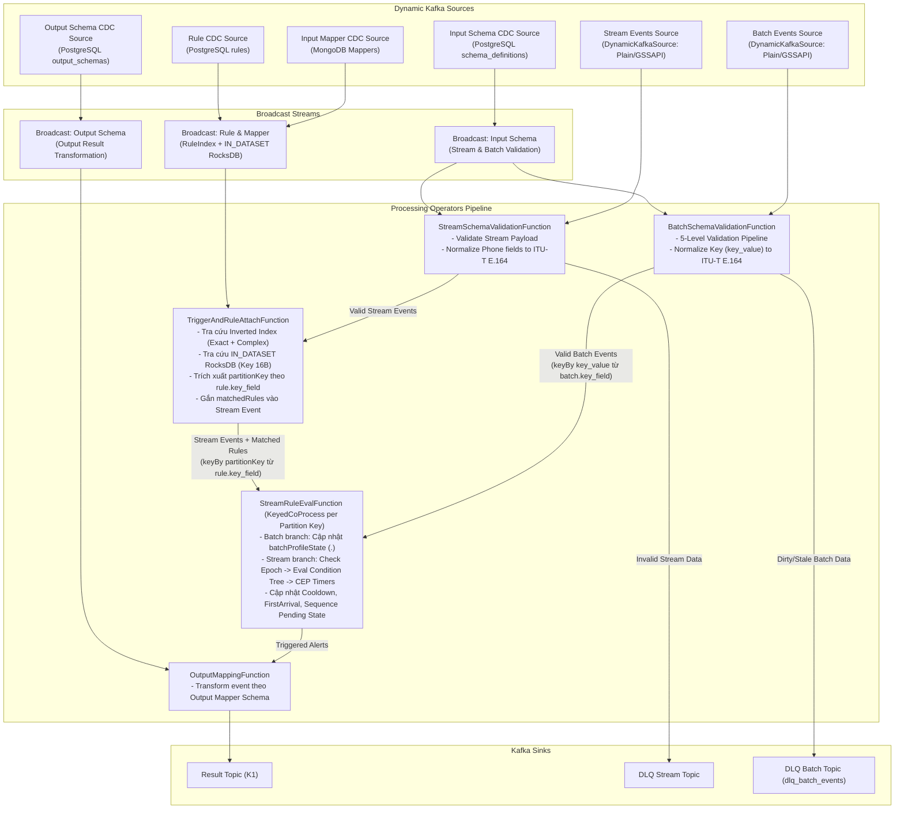

# Bản Thiết Kế Triển Khai Chi Tiết: Stateful Streaming Core

> **Mục tiêu tài liệu:** Mô tả chi tiết bài toán, kiến trúc tổng thể, thiết kế từng component, luồng xử lý dữ liệu end-to-end, chiến lược tối ưu hiệu năng, và kế hoạch triển khai từng phase. Tài liệu này là bản đồ kỹ thuật chuẩn mực cho toàn bộ quá trình phát triển hệ thống Stateful Streaming Core trên Apache Flink.

---

## 1. Tổng Quan Bài Toán

### 1.1. Mục tiêu cốt lõi

Xây dựng một **lõi xử lý dữ liệu streaming có trạng thái (Stateful Streaming Core)** trên Apache Flink, có khả năng:
- Tiếp nhận dữ liệu thời gian thực từ **nhiều nguồn Kafka đồng thời** (đa cluster, đa topic) cho cả luồng Stream Events (realtime) và Batch Events (định kỳ).
- Đánh giá hàng nghìn **rule nghiệp vụ cấu hình động** (không cần restart job) trên mỗi event đến.
- Hỗ trợ **Custom External Datasets / Mappers** lưu trữ tại MongoDB và đồng bộ vào Flink phục vụ tra cứu danh mục tự định nghĩa lớn (`IN_DATASET`) ngay tại tầng Trigger.
- Duy trì **trạng thái hồ sơ khách hàng (batch profile state)** theo từng `msisdn` dựa trên mô hình **Entity - Feature Group** (`<dataset_name>.<field>`).
- Triệt tiêu hoàn toàn hiện tượng **"Trạng thái ma" (Ghost State)** khi luồng Batch chỉ nạp Positive Records bằng cơ chế **Snapshot Epoch / Active Batch ID** kết hợp **RocksDB State TTL 36h**.
- Hỗ trợ **Complex Event Processing (CEP)**: phát hiện chuỗi sự kiện theo thời gian (timeout, absence, sequence).
- Tự động chuyển đổi định dạng kết quả cảnh báo đầu ra theo **Output Mapper Schema**.

### 1.2. Ba bài toán nghiệp vụ trọng tâm

| Bài toán | Tên gọi | Mô tả | Loại xử lý |
|:---------|:--------|:------|:------------|
| **B** | Realtime Lookup Batch State | Bắt event stream thỏa điều kiện, tra cứu vào state được cập nhật từ luồng batch (theo namespace `<dataset_name>.<field>`), có đối soát Snapshot Epoch (`_meta:<dataset_name>:batch_id == active_batch_id`) chống trạng thái ma. | Stateless trigger + Stateful lookup $O(1)$ |
| **A1** | Deduplication / First Arrival | Từ nhiều nguồn event (≥4 topic), gom theo composite key (`id`, `trans_type`), chỉ giữ event đầu tiên theo `processing_time`, loại bỏ các event trùng lặp trong khoảng TTL. | Stateful (IS_FIRST_ARRIVAL) |
| **A2** | CEP Drop-off Detection | Phát hiện giao dịch đứt gãy: Event A xuất hiện nhưng Event B không xuất hiện trong X giây (cùng `device_session_id`). Nếu timeout → phát cảnh báo. | Stateful CEP (NOT_FOLLOWED_BY + Timer) |

### 1.3. Ràng buộc phi chức năng

| Ràng buộc | Chi tiết |
|:----------|:---------|
| **Zero Downtime** | Thêm/sửa/xóa rule, schema, mapper, cluster, topic mà **không restart Flink job**. |
| **Không hỗ trợ REGEX/LIKE trong Rule** | Tránh ReDoS $O(2^N)$ và cache misses. Chỉ dùng `STARTS_WITH`, `ENDS_WITH`, `CONTAINS` (tận dụng JVM intrinsic SIMD). |
| **Khóa phân vùng động (`key_field`) & Chuẩn hóa** | Khóa phân vùng cho luồng Stream không bị hardcode cố định thành `msisdn`, mà được **xác định động theo trường `key_field` khai báo cho từng `source` trong `trigger_criteria` của Rule** (ví dụ: `msisdn`, `phone_number`, `customer_id`). Tương tự, luồng Batch lấy từ trường `key_field` / `key_value` trong Envelope. Với các trường số điện thoại, giá trị bắt buộc được tự động chuẩn hóa về định dạng quốc tế **ITU-T E.164** (`+84...`, `+856...`) qua `KeyNormalizer`. |
| **State Backend** | RocksDB với incremental checkpoint, hỗ trợ State TTL tự động dọn rác đĩa trong background compaction. |
| **Cấu hình tập trung** | **PostgreSQL** (Rule, Input Schema, Output Schema, Kafka stream/batch cluster configs) + **MongoDB** (`Mappers` quản lý custom external datasets / lookup tables cho `IN_DATASET`). |

---

## 2. Kiến Trúc Tổng Thể

### 2.1. Component Diagram

Hệ thống được tổ chức thành 4 tầng rõ ràng: **Lớp Cấu Hình Tập Trung**, **Tầng CDC (Debezium)**, **Hệ Thống Message Broker (Apache Kafka)**, và **Lõi Xử Lý Flink Core**.



### 2.2. Luồng dữ liệu end-to-end (Data Flow)

Toàn bộ quá trình vận hành dữ liệu diễn ra liên tục theo các chặng chuyên biệt:



1. **Khám phá nguồn động (Dynamic Source Discovery):** `PostgresKafkaMetadataService` định kỳ truy vấn bảng `kafka_stream_cluster_config` và `kafka_batch_cluster_config` để tự động phát hiện các cụm Kafka và danh sách topic mới mà không cần restart job.
2. **Thẩm định & Chuẩn hóa khóa (Validation & Key Normalization):**
   - **Luồng Stream:** `StreamSchemaValidationFunction` đối soát payload với schema tương ứng và dùng `KeyNormalizer` làm sạch các trường số điện thoại (nếu có) về chuẩn quốc tế ITU-T E.164.
   - **Luồng Batch:** `BatchSchemaValidationFunction` thực hiện quy trình thẩm định 5 tầng (Protocol $\rightarrow$ Key Normalizer E.164 $\rightarrow$ Schema Registry $\rightarrow$ Anti-Stale $\rightarrow$ Field Constraints). Dữ liệu sai lệch được đẩy sang topic `dlq_batch_events`.
3. **Lọc Trigger sớm & Trích xuất Khóa phân vùng động (Inverted Index + IN_DATASET + Key Extraction):**
   - Chỉ áp dụng cho **Stream Events**.
   - Tra cứu qua bộ Dual-Index (`ExactMatchIndex` $O(1)$ và `ComplexPredicateIndex`) kết hợp RocksDB `IN_DATASET` Storage Engine từ mapper.
   - Lọc bỏ $\ge 95\%$ event rác. Khi event thỏa mãn trigger của rule, hệ thống đọc trường được cấu hình trong **`key_field`** tương ứng với `source` đó trong `trigger_criteria` của Rule (ví dụ `msisdn`, `phone_number` hoặc `customer_id`), trích xuất giá trị (chuẩn hóa E.164 nếu là phone) và gán làm thuộc tính `partitionKey` của event.
4. **Phân vùng khóa động (KeyBy theo partitionKey / key_value):** Cả 2 luồng đều thực hiện `keyBy` theo giá trị khóa thực tế được định nghĩa động (luồng Stream phân vùng theo `event.getPartitionKey()`, luồng Batch phân vùng theo `event.getKeyValue()`), đảm bảo dữ liệu của cùng một chủ thể (thuê bao/khách hàng) đổ về đúng một TaskManager / slot xử lý state.
5. **Hội tụ trạng thái & Đánh giá logic (Keyed CoProcessFunction):**
   - **Nhánh Batch:** Nạp/xóa trạng thái hồ sơ vào `batchProfileState` theo namespace `<dataset_name>.<field>`, cập nhật Snapshot Epoch `_meta:<dataset_name>:batch_id`, áp dụng RocksDB State TTL 36h.
   - **Nhánh Stream:** Kiểm tra Cooldown, kiểm tra Snapshot Epoch chống Ghost State (`State._meta:<dataset_name>:batch_id == active_batch_id`), đánh giá Condition Tree (cost-based short-circuit: stateless trước, stateful sau), xử lý CEP timers (A1 First Arrival, A2 Drop-off), cập nhật state tương ứng.
6. **Định dạng kết quả (Output Mapping):** Các event thỏa mãn rule chuyển qua toán tử `Mapping event với Output Mapper schema`, kết hợp với `Broadcast Output Mapper Schema DataStream` để định dạng JSON chuẩn rồi ghi vào `Result topic`.

---

## 3. Thiết Kế Chi Tiết Từng Component

### 3.1. Rule Compiler & Dynamic Rule Ingestion

> **Vị trí:** Chạy tại thời điểm Rule CDC đến từ topic `Rule topic` trong `BroadcastProcessFunction`.  
> **Tham chiếu:** [04_RULE_SCHEMA.md](./04_RULE_SCHEMA.md) & [06_RULE_INVERTED_INDEX.md](./06_RULE_INVERTED_INDEX.md)

#### Mục đích
Biên dịch trực tiếp cấu hình Rule từ PostgreSQL sang cấu trúc bộ nhớ tối ưu (`CompiledRuleEnvelope`), cấp phát Slot ID cho Inverted Index, phân loại loại hình rule, và liên kết trực tiếp với schema nguồn mà không cần tầng AST field rewriting trung gian.

```text
┌─────────────────────────────────────────────────────────────────┐
│ Rule CDC Event đến (từ Kafka topic T_RULE)                      │
│   rule_id, trigger_criteria, condition_tree, cooldown, ttl...   │
└───────────────────────────────┬─────────────────────────────────┘
                                │
                                ▼
┌─────────────────────────────────────────────────────────────────┐
│ Bước 1: Cấp phát Slot ID (SlotManager - RoaringBitmap)          │
│   slot_id = slotManager.allocateSlot(rule_id)                   │
└───────────────────────────────┬─────────────────────────────────┘
                                │
                                ▼
┌─────────────────────────────────────────────────────────────────┐
│ Bước 2: Đăng ký Trigger Criteria & Lưu key_field                │
│   - Lưu key_field cho từng source (msisdn, phone_number...)     │
│   - Tách Exact Match (==, IN) -> exactIndex.get("field:val").add│
│   - Tách Complex Predicates (>, <, BETWEEN) -> complexIndex.add │
│   - Tách IN_DATASET -> Tham chiếu dataset_id để đối soát RocksDB │
└───────────────────────────────┬─────────────────────────────────┘
                                │
                                ▼
┌─────────────────────────────────────────────────────────────────┐
│ Bước 3: Phân loại RuleType                                      │
│   - STATELESS: Chỉ kiểm tra trường trên event stream hiện tại    │
│   - STATEFUL: Cần tra cứu batchProfileState hoặc IN_DATASET     │
│   - CEP: Có chứa SEQUENCE (NOT_FOLLOWED_BY) hoặc IS_FIRST_ARRIVAL│
└───────────────────────────────┬─────────────────────────────────┘
                                │
                                ▼
┌─────────────────────────────────────────────────────────────────┐
│ Bước 4: Pre-compile Condition Tree                              │
│   - Chuyển đổi danh sách IN / NOT IN thành HashSet<Object>      │
│   - Pre-parse các biểu thức số học (Expression AST)             │
│   - Gắn namespace trực tiếp (<source>.<field>, <dataset>.<field>)│
└───────────────────────────────┬─────────────────────────────────┘
                                │
                                ▼
┌─────────────────────────────────────────────────────────────────┐
│ Bước 5: Đóng gói CompiledRuleEnvelope                           │
│   Lưu trữ vào slotToRule[slot_id] và broadcast sang TaskManagers │
└─────────────────────────────────────────────────────────────────┘
```

#### Cấu trúc POJO CompiledRuleEnvelope

```java
public class CompiledRuleEnvelope implements Serializable {
    private final String ruleId;
    private final int slotId;                           // Bit position trong RoaringBitmap
    private final RuleType ruleType;                    // STATELESS, STATEFUL, CEP
    private final List<CompiledTriggerCriteria> triggers; // Danh sách trigger criteria kèm keyField
    private final ConditionNode conditionTree;          // Pre-compiled AST
    private final long cooldownSeconds;                 // Thời gian giãn cách bắn alert
    private final Map<String, Object> outputMetadata;   // Thông tin kèm theo khi alert
}

public class CompiledTriggerCriteria implements Serializable {
    private final String source;
    private final String schemaVersion;
    private final String keyField;                      // Tên trường phân vùng động (msisdn, phone_number...)
    private final List<List<TriggerCondition>> dnfConditions;
}

public enum RuleType {
    STATELESS,   // Đánh giá in-memory trên event hiện tại
    STATEFUL,    // Đọc/ghi Keyed State (batch profile lookup, IN_DATASET)
    CEP          // Đăng ký EventTime/ProcessingTime Timer + Sequence MapState
}
```

---

### 3.2. Input Mapper & IN_DATASET Storage Engine

> **Vị trí:** Quản lý dữ liệu tự định nghĩa bên ngoài từ MongoDB, đồng bộ qua Kafka topic `Input Mapper topic` và lưu trữ tại RocksDB State.  
> **Tham chiếu:** [IN_DATASET_STORAGE_SPEC.md](./IN_DATASET_STORAGE_SPEC.md)

#### Vai trò mới của MongoDB `Mappers`
MongoDB không còn làm nhiệm vụ đổi tên trường, mà đóng vai trò là **kho lưu trữ các tập danh mục/dữ liệu ngoại lai tự định nghĩa (Custom External Datasets / Lookup Tables)** do người dùng quản trị (ví dụ: Danh sách đen tài khoản `dataset_blacklist_accounts`, danh mục mã gian lận theo kênh `dataset_high_risk_tuples`, v.v.).

```json
{
  "dataset_id": "dataset_high_risk_tuples_q3",
  "dataset_version": "v1",
  "fields": ["mcc_code", "transaction_channel", "device_province_code"],
  "values": [
    [5411, "MOBILE_APP", "HN"],
    [5812, "WEB", "HCM"]
  ]
}
```

#### Thiết kế lưu trữ tối ưu trên RocksDB (16 Bytes Key + Binary Bucket)

Để hỗ trợ hàng triệu bộ giá trị (tuples) đa trường mà không làm tràn RAM hay tốn CPU serialize/deserialize JSON, hệ thống áp dụng cơ chế băm và lưu trữ nhị phân chuyên biệt:

```text
┌──────────────────── KEY ROCKSDB (16 Bytes cố định) ────────────────────┐
│      xxHash64(dataset_id) [8 Bytes]    │    xxHash64(tuple_bytes) [8 Bytes]    │
└────────────────────────────────────────┴───────────────────────────────────────┘
                                         │
                                         ▼
┌──────────────────────── VALUE (Binary Bucket Format) ──────────────────────────┐
│ count [1B] │ len₁ [2B] │ raw₁ [L₁ Bytes] │ len₂ [2B] │ raw₂ [L₂ Bytes] │ ...   │
└────────────────────────────────────────────────────────────────────────────────┘
```

1. **Length-prefixed Binary Encoding (Ghép Tuple an toàn):**
   Mỗi trường trong tuple được biểu diễn bằng `[Độ dài mảng byte (2 bytes)]` + `[Mảng byte dữ liệu]`.
   $$\text{Encoded Bytes} = [\text{len}_1][\text{bytes}_1] + [\text{len}_2][\text{bytes}_2] + \dots$$
   *Ưu điểm:* Zero-allocation, không bị dính ký tự phân cách (như lỗi ghép chuỗi bằng `_`), độc lập với nội dung chuỗi.
2. **Khóa 16 Bytes cố định:** Ghép 8 bytes hash của `dataset_id` và 8 bytes hash của mảng byte tuple vừa encode qua hàm băm siêu tốc `xxHash64`. Vừa vặn trong thanh ghi CPU L1/L2 cache.
3. **Value Binary Bucket chống đụng độ (Collision Resolution):**
   Nếu xảy ra đụng độ hàm băm 64-bit, hệ thống dùng kỹ thuật Separate Chaining ngay trong Value nhị phân. Khi đọc, Flink chỉ cần gọi `Arrays.equals` giữa tuple đầu vào và các raw bytes trong bucket, đảm bảo **độ chính xác tuyệt đối 100%**.

#### Quy trình Đọc $O(1)$ khi thẩm định Trigger `IN_DATASET`
Khi Stream Event đến toán tử Trigger Filter:
```text
Stream Event {mcc_code: 5411, channel: "MOBILE_APP", province: "HN"}
     │
     ▼
[1] Encode Tuple: tuple_bytes = encodeTuple(5411, "MOBILE_APP", "HN")
     │
     ▼
[2] Băm Key 16B: key = [xxHash64("dataset_high_risk"), xxHash64(tuple_bytes)]
     │
     ▼
[3] Tra cứu RocksDB State: bucket = rocksDB.get(key)
     │
     ├── null ───────────────► DROP / KHÔNG KHỚP TRIGGER
     │
     └── có Bucket ──────────► Duyệt từng raw tuple trong bucket:
                                 if (Arrays.equals(raw_i, tuple_bytes)) -> PASS TRIGGER!
```

---

### 3.3. Batch Validation & Key Normalization Engine

> **Vị trí:** Xử lý trực tiếp các bản tin từ các topic `Batch Event topics` trước khi đi vào `keyBy(msisdn)`.  
> **Tham chiếu:** [07_BATCH_EVENT_SCHEMA.md](./07_BATCH_EVENT_SCHEMA.md)

#### Mô hình "Entity - Feature Group"
Trong thực tế DWH/Data Lake, các câu lệnh Spark/Hive ETL luôn **JOIN và AGGREGATE từ nhiều bảng vật lý** (ví dụ: `sor JOIN cms JOIN s`). Do đó, bản tin Batch không gắn với một bảng đơn lẻ mà gắn với **Nhóm Đặc Trưng Nghiệp Vụ (`dataset_name`)** và định danh tác vụ (`pipeline_id`).

#### Cấu trúc JSON Envelope chuẩn
```json
{
  "dataset_name": "sub_profile",
  "pipeline_id": "HIVE_ETL_SUB_ORDER_REQUEST_DAILY",
  "schema_version": "v1",
  "batch_id": "BATCH_20260921_001",
  "snapshot_time": "2026-09-21T02:30:00.000+07:00",
  "sync_mode": "UPSERT",
  "key_field": "msisdn",
  "key_value": "+84981234567",
  "data": {
    "sub_code": "VTM1",
    "status": 1,
    "start_date": "2024-01-01T00:00:00.000+07:00",
    "package_code": "ST120K",
    "arpu_last_3m": 150000.5
  }
}
```

#### Chuẩn hóa khóa quốc tế E.164 (`KeyNormalizer`)
- Khóa định danh thuê bao được tự động làm sạch ký tự lạ (` `, `-`, `(`, `)`).
- Số nội địa (`0981234567`) tự động thêm tiền tố quốc gia mặc định $\rightarrow$ `+84981234567`.
- Kiểm tra hợp lệ với Regex chuẩn E.164: `^\+[1-9][0-9]{6,14}$`.

#### Quy trình thẩm định 5 tầng (5-Level Validation Pipeline)



#### Ma trận ràng buộc kiểu dữ liệu hỗ trợ (Mục 3.3 từ `07_BATCH_EVENT_SCHEMA.md`)
Hệ thống hỗ trợ 6 kiểu dữ liệu bảng phẳng sau ETL: **`STRING`**, **`INT`**, **`LONG`**, **`DOUBLE`**, **`BOOLEAN`**, **`TIMESTAMP`**.

| Thuộc tính ràng buộc | Kiểu áp dụng | Quy chuẩn & Logic kiểm tra tại Flink | Mã lỗi DLQ |
|:---|:---|:---|:---|
| **`required`** | Tất cả (`ALL`) | Kiểm tra sự tồn tại của key trong khối `data`. | `ERR_BATCH_MISSING_REQUIRED_FIELD` |
| **`nullable`** | Tất cả (`ALL`) | Không cho phép giá trị null nếu `nullable = false`. | `ERR_BATCH_NULL_NOT_ALLOWED` |
| **`allowed_values`** | `STRING`, `INT`, `LONG` | Whitelist Enum: tra cứu $O(1)$ qua Pre-compiled `HashSet`. | `ERR_BATCH_ENUM_VIOLATION` |
| **`min` / `max`** | Số, `TIMESTAMP` | Giới hạn ngưỡng giá trị số học: $min \le value \le max$. | `ERR_BATCH_OUT_OF_RANGE` |
| **`min_length` / `max_length`**| `STRING` | Giới hạn độ dài chuỗi ký tự, chống phình to State. | `ERR_BATCH_STRING_TOO_LONG` / `SHORT` |
| **`format`** | `STRING`, `TIMESTAMP` | Định dạng chuyên biệt: `ISO-8601`, `PHONE_E164`, `UUID`. | `ERR_BATCH_FORMAT_MISMATCH` |
| **`regex_pattern`** | `STRING` | Thẩm định mẫu biểu thức chính quy (CCCD, mã hợp đồng). | `ERR_BATCH_PATTERN_MISMATCH` |
| **`default_value`** | Số, String, Boolean | Tự động điền giá trị mặc định nếu thiếu trong chế độ `UPSERT`. | Không bắn lỗi (Auto-fill) |

---

### 3.4. Inverted Index Trigger Engine

> **Tham chiếu:** [06_RULE_INVERTED_INDEX.md](./06_RULE_INVERTED_INDEX.md)

#### Kiến trúc Dual-Index
Mỗi cặp `(source, schema_version)` của luồng Stream sở hữu một bộ Inverted Index riêng:
- **Tập 1: Exact Match ($O(1)$ lookup):** Map lưu trữ `"field:value"` trỏ tới `RoaringBitmap` (ví dụ: `"serviceCode:TOPUP"` $\rightarrow$ bitmap `[Rule 3, Rule 7]`).
- **Tập 2: Complex Predicate:** Bitmap duy nhất đánh dấu các rule sử dụng toán tử phức tạp (`>`, `<`, `BETWEEN`, `CONTAINS`).
- **Tích hợp `IN_DATASET`:** Các rule có điều kiện trigger `IN_DATASET` sẽ đối soát nhanh với RocksDB Storage Engine (Key 16B).

#### Quy trình thẩm định Trigger trên Stream Event
```text
Stream Event {source: "CPM", version: "v2", payload: {serviceCode: "TOPUP", amount: 5000000}}
    │
    ▼
[1] Tra Tập 1 (ExactMatch):
    bm1 = exactIndex.get("serviceCode:TOPUP")
    bm2 = exactIndex.get("amount:5000000")
    exactCandidates = FastOR(bm1, bm2)
    │
    ▼
[2] Tra Tập 2 (Complex):
    complexCandidates = complexIndex
    │
    ▼
[3] Gộp ứng viên & Lọc rác:
    candidates = (exactCandidates | complexCandidates) & NOT(freeSlots)
    │
    ▼
[4] Thẩm định DNF chi tiết (kèm IN_DATASET RocksDB lookup):
    for slotId in candidates:
        if (evaluateTrigger(rule.triggers, event)):
            matchedRules.add(slotToRule[slotId])
    │
    ▼
[5] Trích xuất partitionKey theo rule.key_field:
    // Trích xuất giá trị trường khóa phân vùng theo cấu hình key_field của source trong rule
    partitionKey = event.get(rule.triggers.keyField) 
    if (isPhoneNumber(partitionKey)) {
        partitionKey = KeyNormalizer.normalizeToE164(partitionKey)
    }
    event.setPartitionKey(partitionKey)
    Gắn matchedRules vào Stream Event -> Chuyển sang keyBy(partitionKey)
```

---

### 3.5. Condition Tree Evaluator

> **Tham chiếu:** [04_RULE_SCHEMA.md](./04_RULE_SCHEMA.md)

#### Chiến lược đánh giá Cost-Based Short-Circuit
Khi Stream Event đã vượt qua tầng Trigger và đi vào CoProcess, Condition Tree được thẩm định với chiến lược phân loại chi phí nhằm tối ưu hóa CPU và I/O:

```text
Khi đánh giá node AND:
  1. Phân loại children:
     - cheapNodes: STATELESS conditions (so sánh số, chuỗi trên stream payload) -> O(1) in-memory.
     - expensiveNodes: STATEFUL conditions (tra cứu batchProfileState, IN_DATASET, CEP).
  2. Đánh giá cheapNodes trước:
     - Nếu BẤT KỲ cheapNode nào = false -> RETURN FALSE NGAY LẬP TỨC (Bỏ qua 100% I/O đọc State).
  3. Chỉ khi TẤT CẢ cheapNodes = true:
     - Đánh giá expensiveNodes, áp dụng short-circuit khi gặp false đầu tiên.
```

#### Bảng toán tử và độ phức tạp

| Nhóm | Toán tử | Triển khai Java | Độ phức tạp |
|:---|:---|:---|:---|
| So sánh số | `==`, `!=`, `>`, `<`, `>=`, `<=` | `Double.compare()` hoặc `Long.compare()` | $O(1)$ |
| Khoảng | `BETWEEN` | `min <= value && value <= max` | $O(1)$ |
| Tập hợp nhỏ | `IN`, `NOT IN` | Pre-compiled `HashSet<Object>` | $O(1)$ |
| Tập hợp lớn | `IN_DATASET` | RocksDB Lookup (Key 16B = `xxHash64(dataset_id)` + `xxHash64(tuple)`) | $O(1)$ disk |
| Chuỗi exact | `==`, `!=` | `String.equals()` (SIMD) | $O(L)$, early exit |
| Chuỗi prefix/suffix/con | `STARTS_WITH`, `ENDS_WITH`, `CONTAINS` | JVM intrinsic SIMD vectorization | $O(P)$, $O(S)$, $O(N)$ |
| Null check | `IS_NULL`, `IS_NOT_NULL` | `value == null` | $O(1)$ |
| Biểu thức số | `expr` (vd: `a * 0.7 + b * 0.3`) | Pre-parsed AST evaluation | $O(K)$ nodes |
| Cross-field | `right_field` | Đối chiếu 2 trường trong cùng event | $O(1)$ |

---

### 3.6. Stateful CEP Engine

#### Case A2: NOT_FOLLOWED_BY (Giao dịch đứt gãy)
- **Cơ chế:** Khi Event A xuất hiện, lưu `SequencePendingEntry` vào `pendingSequences` (Keyed MapState) và đăng ký Event-Time Timer (`t_A + X_seconds`).
- Nếu Event B đến trước khi timer nổ (cùng `device_session_id`) $\rightarrow$ Hủy timer, xóa state (giao dịch thành công).
- Nếu `onTimer()` kích hoạt $\rightarrow$ Event B không đến $\rightarrow$ Bắn cảnh báo đứt gãy và xóa state.

#### Case A1: IS_FIRST_ARRIVAL (Deduplication)
- **Cơ chế:** Tạo composite key từ các trường định danh (`id`, `trans_type`).
- Tra cứu vào `firstArrivalState` (MapState có cấu hình Processing-Time TTL).
- Nếu chưa có key $\rightarrow$ Ghi nhận timestamp, cho phép event đi tiếp để đánh giá rule.
- Nếu đã tồn tại key $\rightarrow$ Chặn đứng (drop) vì là bản tin trùng lặp.

---

### 3.7. Keyed CoProcess: Hội Tụ Batch Profile State + Stream Eval

#### Cấu trúc Keyed State cho mỗi `msisdn` (E.164)

```text
┌────────────────────────── Keyed State (per msisdn) ──────────────────────────┐
│                                                                               │
│  ┌─────────────────────────────────┐  ┌───────────────────────────────────┐  │
│  │ batchProfileState (MapState)    │  │ cepPendingState (MapState)        │  │
│  │                                 │  │                                   │  │
│  │ "_meta:sub_profile:snapshot_ts" │  │ Key: "{ruleId}:{joinKeyVal}"      │  │
│  │ "_meta:sub_profile:batch_id"    │  │ Val: PendingEntry {event, timerTs}│  │
│  │ "sub_profile.sub_code"          │  │                                   │  │
│  │ "sub_profile.status"            │  │ TTL: withinMs + buffer            │  │
│  │ "daily_spending.total_vnd"      │  └───────────────────────────────────┘  │
│  │                                 │                                         │
│  │ RocksDB State TTL: 36 Giờ       │  ┌───────────────────────────────────┐  │
│  │ (Cleanup in CompactFilter)      │  │ firstArrivalState (MapState)      │  │
│  └─────────────────────────────────┘  │ Key: compositeKey, Val: firstSeen │  │
│                                       └───────────────────────────────────┘  │
│  ┌─────────────────────────────────┐                                         │
│  │ cooldownState (MapState)        │                                         │
│  │ Key: rule_id, Val: expireTs     │                                         │
│  └─────────────────────────────────┘                                         │
└───────────────────────────────────────────────────────────────────────────────┘
```

#### Cơ Chế Snapshot Epoch & Active Batch ID Chống "Trạng Thái Ma" (Ghost State)
1. **Bản chất vấn đề:** Câu lệnh SQL ETL tại DWH chỉ trích xuất các bản ghi thỏa mãn (`WHERE cms.STATUS = 1 ...`). Nếu thuê bao hôm qua thỏa mãn nhưng hôm nay hết hạn hợp đồng, DWH sẽ **không trả về bản ghi nào** của thuê bao đó $\rightarrow$ Kafka không nhận được event $\rightarrow$ Flink giữ nguyên state cũ!
2. **Giải pháp Snapshot Epoch:**
   - Mỗi mẻ batch mang một `batch_id` duy nhất (ví dụ `BATCH_20260921_001`). Khi nạp state, Flink lưu `_meta:<dataset_name>:batch_id = "BATCH_20260921_001"`.
   - Flink theo dõi mã mẻ đang kích hoạt: `active_batch_id[dataset_name]`.
   - **Khi luồng Stream tra cứu Batch State:** Điều kiện tiên quyết là:
     $$\text{State.\_meta:}\langle\text{dataset\_name}\rangle\text{:batch\_id} == \text{active\_batch\_id}[\text{dataset\_name}]$$
     - *Nếu trùng khớp:* Khách hàng có mặt trong đợt nạp hôm nay $\rightarrow$ Đánh giá tiếp các trường nghiệp vụ.
     - *Nếu không khớp (hoặc mang batch cũ hôm qua):* Khách hàng đã bị loại khỏi mẻ mới $\rightarrow$ **Đánh fail điều kiện batch ngay lập tức**, triệt tiêu $100\%$ lỗi trạng thái ma!
3. **Tự động dọn dẹp đĩa bằng RocksDB State TTL 36h:**
   ```java
   StateTtlConfig ttlConfig = StateTtlConfig
       .newBuilder(Time.hours(36))
       .setUpdateType(StateTtlConfig.UpdateType.OnCreateAndWrite)
       .setStateVisibility(StateTtlConfig.StateVisibility.NeverReturnExpired)
       .cleanupInRocksdbCompactFilter(1000)
       .build();
   ```
   Dữ liệu cũ không được mẻ mới refresh sẽ tự động được RocksDB xóa vĩnh viễn trong quá trình background compaction.

#### Thuật toán cập nhật State (Schema-Driven Point Updates)
Tận dụng danh mục trường từ Schema đã có sẵn trong RAM để thực hiện point updates, tuyệt đối **không gọi `state.keys()`** để tránh quét đĩa RocksDB:
- **`FULL_SNAPSHOT`:** Duyệt qua danh sách `schema.getFieldNames()`: nếu trường có trong payload $\rightarrow$ `state.put()`, nếu không có $\rightarrow$ `state.remove()`.
- **`UPSERT`:** Chỉ `state.put()` các trường xuất hiện trong payload.
- **`DELETE`:** `state.remove()` toàn bộ các trường thuộc schema và metadata của dataset đó.

---

### 3.8. Output Mapping Engine

> **Vị trí:** Chạy tại toán tử `Mapping event với Output Mapper schema` trước khi emit ra Kafka sink.

- Nhận các event kết quả/cảnh báo thành công từ `KeyedCoProcessFunction`.
- Nhận luồng `Broadcast Output Mapper Schema DataStream` từ topic `Output Mapper Schema topic` (nguồn từ bảng `Output_schema` trong PostgreSQL).
- Chuyển đổi event kết quả sang cấu trúc JSON định dạng chuẩn hóa theo yêu cầu của hệ thống hạ tầng nhận tin (downstream consumers) và đẩy vào `Result topic`.

---

## 4. Flink Job Topology (Operator Graph)



---

## 5. Chiến Lược Tối Ưu Hiệu Năng

### 5.1. Tối ưu CPU

| Tầng | Kỹ thuật | Hiệu quả dự kiến |
|:---|:---|:---|
| **Trigger Filter** | **Inverted Index + RoaringBitmap** | Lọc bỏ $\ge 95\%$ rule không liên quan trước khi vào Condition Tree. |
| **Trigger Filter** | **Lọc trước khi keyBy network shuffle** | Chỉ những event thực sự khớp rule mới bị shuffle qua mạng, giảm $90\%$ network bandwidth. |
| **IN_DATASET** | **Key 16 Bytes cố định (`xxHash64`)** | Băm mảng tuple bất kỳ về 16 bytes, vừa vặn trong L1/L2 cache, tra cứu $O(1)$. |
| **Condition Tree** | **Cost-based short-circuit** | Đánh giá điều kiện stateless in-memory trước; nếu false, bỏ qua $100\%$ I/O đọc State. |
| **String Ops** | **JVM Intrinsic SIMD Vectorization** | `equals()`, `startsWith()`, `contains()` tận dụng tập lệnh AVX2/AVX-512 trên CPU. |
| **No AST Rewrite** | **Direct Schema Binding** | Rule bind trực tiếp với schema nguồn, loại bỏ hoàn toàn chi phí đệ quy rewrite AST. |

### 5.2. Tối ưu Memory & State

| Kỹ thuật | Chi tiết |
|:---|:---|
| **RocksDB State Backend** | Lưu trữ state trên ổ đĩa NVMe/SSD, incremental checkpoint định kỳ, chịu tải hàng chục triệu thuê bao. |
| **Binary Bucket Format** | Lưu dữ liệu `IN_DATASET` dạng byte nhị phân thuần túy, zero object allocation, không tốn RAM JVM heap. |
| **Schema-Driven Point Updates** | Cập nhật Batch State theo danh sách trường có sẵn trong RAM từ Schema, triệt tiêu lệnh quét đĩa `state.keys()`. |
| **Snapshot Epoch Check $O(1)$** | Chống trạng thái ma bằng phép so sánh số nguyên `batch_id == active_batch_id`, không cần chạy Full Outer Join tại ETL. |
| **RocksDB State TTL 36 Giờ** | Tự động dọn dẹp các bản ghi hết hạn thông qua `cleanupInRocksdbCompactFilter` mà không tốn lệnh xóa thủ công. |
| **RoaringBitmap** | Nén tự động theo mật độ bit (Array / Bitset / RLE), tiết kiệm RAM 10–100x so với Java `BitSet`. |

---

## 6. Kế Hoạch Triển Khai Theo Phase

### Phase 1: Hạ Tầng & Khung Xương (Tuần 1 — 16/09 → 25/09)

| Task | Người thực hiện | Mô tả chi tiết |
|:-----|:----------------|:----------------|
| **Hạ tầng Docker** | Khoa | Docker Compose: PostgreSQL (5 bảng), MongoDB (Mappers), Kafka KRaft, Debezium CDC (Postgres + Mongo), Flink cluster. |
| **Schema PostgreSQL** | Khoa | DDL bảng: `rules`, `schema_definitions`, `output_schemas`, `kafka_stream_cluster_config`, `kafka_batch_cluster_config`. |
| **CDC Pipeline** | Khoa | Cấu hình Debezium connectors cho PostgreSQL (rules, schemas) và MongoDB (mappers) đẩy vào Kafka topics tương ứng. |
| **Data Generator** | Thịnh | Sinh event giả lập cho luồng Stream (CPM, EVT) và luồng Batch (sub_profile, daily_spending) theo chuẩn E.164. |
| **DynamicKafkaSource** | Thịnh | Triển khai `PostgresKafkaMetadataService` tự động đọc cấu hình cluster/topic từ PostgreSQL. |
| **Flink Job Skeleton** | Thịnh | Khung `RealtimeCepJob` kết nối các source, broadcast stream và sink cơ bản. |

---

### Phase 2: Dual Validation + Inverted Index + Batch State + IN_DATASET Storage (Tuần 2 — 28/09 → 02/10)

| Task | Người thực hiện | Mô tả chi tiết |
|:-----|:----------------|:----------------|
| **KeyNormalizer** | Thịnh | Tiện ích chuẩn hóa số điện thoại nội địa/quốc tế về chuẩn ITU-T E.164 (`+84...`). |
| **StreamSchemaValidationFunction** | Thịnh | BroadcastProcessFunction validate payload stream theo schema, chuẩn hóa key E.164. |
| **BatchSchemaValidationFunction** | Thịnh | BroadcastProcessFunction thẩm định Batch 5 tầng (Protocol, Key Normalizer, Schema, Anti-Stale, Field Constraints). Sai $\rightarrow$ DLQ. |
| **Batch State Update Logic** | Thịnh | Trong CoProcess, cập nhật `batchProfileState` theo `<dataset_name>.<field>`, Schema-Driven Point Updates, lưu Epoch `batch_id`. |
| **Rule Compiler** | Khoa | Parse rule JSON $\rightarrow$ `CompiledRuleEnvelope` (gắn direct schema, phân loại RuleType, cấp phát Slot ID). |
| **IN_DATASET Storage Engine** | Khoa | Triển khai băm `xxHash64`, Length-prefixed binary encoding, Key 16B và Binary Bucket trên RocksDB State theo [IN_DATASET_STORAGE_SPEC.md](./IN_DATASET_STORAGE_SPEC.md). |
| **Inverted Index Engine** | Khoa | Triển khai `ExactMatchIndex` + `ComplexPredicateIndex` + `SlotManager` (RoaringBitmap COW). |
| **TriggerAndRuleAttachFunction** | Khoa | BroadcastProcessFunction: Tra cứu Inverted Index + tra cứu RocksDB `IN_DATASET`, lọc và gắn matched rules vào Stream Event. |

---

### Phase 3: Condition Tree Evaluator + Stateful CEP Logic (Tuần 3 — 05/10 → 09/10)

| Task | Người thực hiện | Mô tả chi tiết |
|:-----|:----------------|:----------------|
| **ConditionTreeEvaluator** | Khoa | Đánh giá đệ quy AND/OR/CONDITION với Cost-Based Short-Circuit (stateless trước, stateful sau). |
| **Toàn bộ toán tử** | Khoa | Triển khai `==`, `!=`, `>`, `<`, `BETWEEN`, `IN`, `NOT IN`, `STARTS_WITH`, `ENDS_WITH`, `CONTAINS`, `IS_NULL`, cross-field, expression evaluator. |
| **Snapshot Epoch Matching** | Thịnh | Tích hợp kiểm tra `State._meta:<dataset_name>:batch_id == active_batch_id` trước khi tra cứu batch field, chống Ghost State. |
| **IS_FIRST_ARRIVAL (A1)** | Thịnh | Stateful dedup operator với composite key + Processing-Time TTL timer. |
| **CEP SEQUENCE (A2)** | Thịnh | `NOT_FOLLOWED_BY` với Event-Time Timer + `pendingSequences` MapState + xóa state khi hoàn tất. |
| **RocksDB State TTL 36h** | Thịnh | Cấu hình `StateTtlConfig` dọn rác đĩa ngầm cho `batchProfileState`. |

---

### Phase 4: Output Mapping, Monitoring, Testing & Đóng Gói (Tuần 4–5 — 12/10 → 23/10)

| Task | Người thực hiện | Mô tả chi tiết |
|:-----|:----------------|:----------------|
| **OutputMappingFunction** | Thịnh | BroadcastProcessFunction đọc `Output Mapper Schema`, format kết quả alert và sink vào `Result topic`. |
| **Prometheus Metrics** | Chung | Đo lường metrics: event throughput, trigger hit rate, rule eval latency, RocksDB state size. |
| **Grafana Dashboard** | Chung | Trực quan hóa dashboard vận hành realtime. |
| **Integration Test** | Chung | Kiểm thử end-to-end cho cả 3 bài toán (B, A1, A2), kiểm thử chống Ghost State và kiểm thử đụng độ hash `IN_DATASET`. |
| **Load Test & Benchmark** | Chung | Thử tải 10K events/s $\times$ 1000 rules, đo P99 latency và checkpoint duration. |
| **Documentation & Demo** | Chung | Hoàn thiện tài liệu kiến trúc, hướng dẫn vận hành và slide thuyết trình. |

---

## 7. Cấu Trúc Thư Mục Đề Xuất

```text
flink-jobs/src/main/java/
├── flink/
│   ├── RealtimeCepJob.java                        # Main Flink topology pipeline
│   │
│   ├── config/
│   │   ├── KafkaClusterConfig.java                # Kafka connection helpers
│   │   └── JobConfig.java                         # Centralized job parameters
│   │
│   ├── models/
│   │   ├── CompiledRuleEnvelope.java              # Pre-compiled rule definition
│   │   ├── ConditionNode.java                     # Sealed interface cho AST Tree
│   │   ├── Expression.java                        # Leaf condition model
│   │   ├── SequenceConfig.java                    # CEP sequence configuration
│   │   ├── TriggerCriteria.java                   # Trigger criteria model
│   │   ├── ValidatedBatchEvent.java               # Batch event envelope sau thẩm định
│   │   ├── BatchSchemaDefinition.java             # Schema định nghĩa tập đặc trưng batch
│   │   ├── MapperDefinition.java                  # Custom dataset / mapper từ MongoDB
│   │   └── DatasetBucket.java                     # Binary bucket format cho IN_DATASET
│   │
│   ├── utils/
│   │   ├── KeyNormalizer.java                     # Chuẩn hóa số điện thoại ITU-T E.164
│   │   └── TupleBinaryEncoder.java                # Length-prefixed binary encoder
│   │
│   ├── compiler/
│   │   ├── RuleCompiler.java                      # Direct schema binding & slot allocation
│   │   └── ExpressionParser.java                  # Arithmetic expression AST parser
│   │
│   ├── index/
│   │   ├── SourceVersionIndex.java                # Inverted index theo source:version
│   │   ├── SlotManager.java                       # RoaringBitmap slot allocator
│   │   └── InvertedIndexManager.java              # COW index lifecycle manager
│   │
│   ├── evaluators/
│   │   ├── ConditionTreeEvaluator.java            # Recursive tree evaluator (Cost-based)
│   │   ├── OperatorEvaluator.java                 # Type-safe operator dispatch
│   │   ├── DatasetLookup.java                     # Tra cứu IN_DATASET Key 16B trên RocksDB
│   │   └── ExpressionEvaluator.java               # Arithmetic expression evaluator
│   │
│   ├── operators/
│   │   ├── StreamSchemaValidationFunction.java    # BroadcastProcess: validate stream event
│   │   ├── BatchSchemaValidationFunction.java     # BroadcastProcess: 5-level batch validation
│   │   ├── TriggerAndRuleAttachFunction.java      # BroadcastProcess: trigger filter + IN_DATASET
│   │   ├── StreamRuleEvalFunction.java            # KeyedCoProcess: eval + batch state + CEP
│   │   └── OutputMappingFunction.java             # BroadcastProcess: transform output schema
│   │
│   └── dynamic/
│       └── metadata/
│           └── PostgresKafkaMetadataService.java  # Dynamic Kafka discovery từ PostgreSQL
```

---

## 8. Dependencies Cần Bổ Sung (pom.xml)

| Dependency | Phiên bản | Mục đích sử dụng |
|:---|:---|:---|
| `org.roaringbitmap:RoaringBitmap` | `1.3.0` | Thao tác Inverted Index bitmap tốc độ cao (SIMD FastOR) |
| `net.openhft:zero-allocation-hashing` | `0.16` | Băm `xxHash64` siêu tốc tạo Key 16 Bytes cho `IN_DATASET` |
| `com.fasterxml.jackson.core:jackson-core` | `2.16.1` | Streaming JSON parser (`JsonParser`) tốc độ cao |
| `org.postgresql:postgresql` | `42.7.7` | JDBC Driver kết nối PostgreSQL (Dynamic Discovery & Schemas) |
| `org.mongodb:mongodb-driver-sync` | `5.3.0` | Driver MongoDB (đọc seed data hoặc debug Mappers) |

---

## 9. Rủi Ro & Giải Pháp Phòng Ngừa

| Rủi ro | Tác động | Giải pháp phòng ngừa kỹ thuật |
|:---|:---|:---|
| **Trạng thái ma (Ghost State) từ luồng Batch** | Luồng stream đọc phải dữ liệu của khách hàng đã hết hạn hôm qua do DWH chỉ nạp Positive records. | **Snapshot Epoch & Active Batch ID**: Điều kiện tiên quyết `State._meta:batch_id == active_batch_id`. Khách hàng bị loại khỏi mẻ mới sẽ bị đánh rớt ngay lập tức. Kết hợp **RocksDB State TTL 36h** dọn đĩa ngầm. |
| **Đụng độ hàm băm trong `IN_DATASET`** | Trả về kết quả khớp sai lệch (tỷ lệ $\approx 10^{-18}$). | **Value Binary Bucket**: Lưu mảng byte gốc và dùng `Arrays.equals` đối soát từng byte khi có hash match $\rightarrow$ Chính xác 100%. |
| **State phình to làm chậm Checkpoint / OOM** | RocksDB checkpoint vượt timeout, Job sụp đổ. | **State TTL bắt buộc** cho toàn bộ state: Batch State (36h), First Arrival (theo rule TTL), CEP Pending (timeout + buffer). Bật incremental checkpoint. |
| **Quét đĩa RocksDB gây suy giảm Throughput** | Gọi `state.keys()` khi cập nhật batch làm đọc khuếch đại ổ đĩa. | **Schema-Driven Point Updates**: Duyệt danh sách trường từ Schema nạp trên RAM để point-put/remove trực tiếp. |
| **Độ trễ mạng do shuffle toàn bộ Event** | TaskManager nghẽn mạng do shuffle cả những event không liên quan. | **Trigger Filter + `IN_DATASET` trước `keyBy`**: Loại bỏ $\ge 95\%$ event rác trước khi đẩy qua shuffle mạng. |
| **Mất dữ liệu khi mạng chập chờn giữa Flink & Kafka** | Bị sót event hoặc ghi đè sai thứ tự. | Cơ chế At-least-once kết hợp Checkpointing định kỳ; tầng Batch áp dụng **Anti-Stale Check (Level 4)** chặn snapshot cũ ghi đè dữ liệu mới. |
