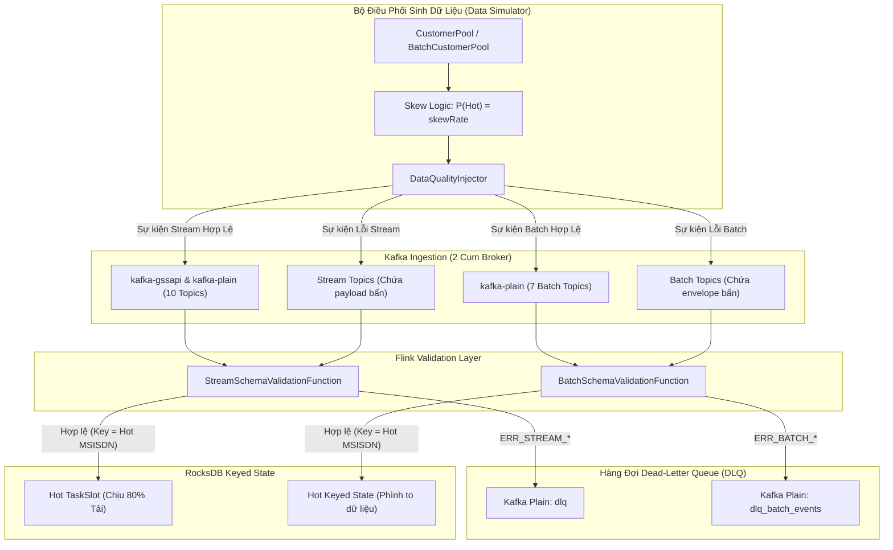

# Realtime Event Simulator — Quá trình thiết kế & sinh dữ liệu sự kiện

## 1. Mục tiêu

Trình giả lập sự kiện thời gian thực (**Realtime Event Simulator**) được xây dựng trong module `data-simulator` nhằm phục vụ các mục tiêu cốt lõi:
- **Kiểm thử hệ thống Stateful Streaming & Rule Engine**: Sinh dữ liệu mô phỏng liên tục dòng sự kiện thanh toán, viễn thông, nạp tiền ví điện tử để kiểm thử các bài toán xử lý trạng thái (Deduplication đa nguồn, Sequence `NOT_FOLLOWED_BY`, Phát hiện giao dịch đứt gãy).
- **Phủ đủ 10 nguồn dữ liệu nghiệp vụ** phân bổ trên **2 cụm Kafka độc lập** với 2 cơ chế bảo mật khác nhau (`SASL_PLAINTEXT / PLAIN` và `SASL_PLAINTEXT / GSSAPI Kerberos`).
- **Đảm bảo tính tương quan dữ liệu xuyên nguồn (Cross-Source Correlation)**: Các sự kiện thuộc cùng một giao dịch được liên kết chặt chẽ qua các trường khóa (`orderId`, `requestId`, `transDailyHisFinanceId`, `msisdn`, `amount`, `status`).
- **Mô phỏng 7 kịch bản nghiệp vụ thực tế** (từ luồng giao dịch thành công, số dư không đủ, timeout đối tác, hiệu chỉnh giao dịch đến dữ liệu biên/lỗi).
- **Linh hoạt trong vận hành**: Hỗ trợ đẩy sự kiện Realtime Streaming, xuất file JSONL phục vụ replay kiểm thử, và chế độ Dry-run an toàn.

---

## 2. Thiết kế Tổng quan

### 2.1. Kiến trúc luồng sinh và phát tán sự kiện

```
                    ┌────────────────────────┐
                    │      CustomerPool      │
                    │  (150 khách hàng mẫu)  │
                    └───────────┬────────────┘
                                │ Chọn KH & Số dư
                                ▼
                    ┌────────────────────────┐
                    │ TransactionCoordinator │
                    │   (Chọn kịch bản 1-7,  │
                    │    sinh TransactionCtx)│
                    └───────────┬────────────┘
                                │ Phối hợp sinh
           ┌────────────────────┴────────────────────┐
           ▼                                         ▼
┌──────────────────────┐                  ┌──────────────────────┐
│  GSSAPI Generators   │                  │   PLAIN Generators   │
│  - V1-INSERT-TRANS   │                  │  - GNOTIFY_SAVE_MSG  │
│  - V1-UPDATE-TRANS   │                  │  - HISTORY_PRODUCT   │
│  - P1-EVENT-TRACKING │                  │  - HISTORY_OBJECT    │
│                      │                  │  - CDCN_LOG_CENTRAL  │
│                      │                  │  - ADS-GIFT-RESULT   │
│                      │                  │  - CORE-RECHARGE-HIS │
│                      │                  │  - PMT-SYNC-CMD(CPM) │
└──────────┬───────────┘                  └──────────┬───────────┘
           │ 3 topics                                │ 7 topics
           ▼                                         ▼
┌────────────────────────────────────────────────────────────────┐
│                     KafkaSimulatorProducer                     │
│    - kafka-gssapi:9094 (Kerberos Keytab + krb5.conf)           │
│    - kafka-plain:9092  (SASL PLAIN admin/admin-secret)         │
│    - File Writer (JSONL theo topic khi export file)            │
│    - Console Logger (khi bật chế độ Dry-run)                   │
└────────────────────────────────────────────────────────────────┘
```

### 2.2. Cấu trúc thư mục mã nguồn

```
data-simulator/src/main/java/com/vdf/streaming/event/
├── EventSimulatorMain.java                   # CLI Entrypoint, cấu hình tham số dòng lệnh
├── BatchSimulatorMain.java                   # CLI Entrypoint cho luồng Batch
├── coordinator/
│   ├── CustomerPool.java                     # Pool 150 khách hàng cố định với dữ liệu thực tế & hỗ trợ Data Skew
│   └── TransactionCoordinator.java           # Phối hợp kịch bản và điều phối 10 generators
├── error/
│   └── DataQualityInjector.java              # Bộ tiêm lỗi / dữ liệu bẩn có kiểm soát cho Stream & Batch (DLQ Testing)
├── model/
│   ├── Customer.java                         # Entity khách hàng (Phone, CCCD, Bank, Balance, Device)
│   ├── Scenario.java                         # Enum 7 kịch bản nghiệp vụ kèm tỉ lệ phân bổ
│   ├── TransactionContext.java               # Context chứa khóa tương quan cho từng giao dịch
│   └── EventRecord.java                      # DTO sự kiện (Topic, ClusterType, Key, Payload)
├── generator/
│   ├── EventGenerator.java                   # Interface chung cho tất cả Event Generators
│   ├── V1InsertTransDailyHisGenerator.java   # Nguồn 1: Giao dịch tài chính cốt lõi (CDC Insert)
│   ├── V1UpdateTransDailyHisGenerator.java   # Nguồn 2: Hiệu chỉnh giao dịch tài chính (CDC Update)
│   ├── P1EventTrackingGenerator.java         # Nguồn 3: Tracking hành vi & OTP trên Mobile App
│   ├── GnotifySaveMessageHbaseGenerator.java # Nguồn 4: Thông báo biến động số dư ví
│   ├── HistoryServiceInsertHbaseProductGenerator.java # Nguồn 5: Lịch sử dịch vụ sản phẩm
│   ├── HistoryServiceInsertHbaseObjectGenerator.java  # Nguồn 6: Lịch sử nạp/thanh toán theo đối tượng
│   ├── CdcnLogCentralProdGenerator.java      # Nguồn 7: Gateway access log tập trung
│   ├── AdsThirdPartyGiftDataResultCmdGenerator.java   # Nguồn 8: Callback tặng gói/quà bên thứ 3
│   ├── CoreRechargeHistoryGenerator.java     # Nguồn 9: Lịch sử nạp tiền ví từ ngân hàng liên kết
│   └── PmtTransactionSyncCmdGenerator.java   # Nguồn 10: Đồng bộ xác nhận GD (CPM cho bài toán A1)
├── batch/
│   ├── BatchDatasetGenerator.java            # Interface chuẩn cho 7 batch dataset generators
│   ├── BatchEnvelopeBuilder.java             # Utility đóng gói JSON Envelope chuẩn 07_BATCH_EVENT_SCHEMA
│   ├── BatchCustomerPool.java                # Quản lý phân bổ tập KH batch & sinh danh sách Skewed Records
│   ├── TrialRegisteredGenerator.java         # B1 ĐK2: Đăng ký gói trial 0đ (msisdn, sub_code)
│   ├── RenewedSubscribersGenerator.java      # B1 ĐK3: KH đã từng gia hạn (msisdn, sub_code)
│   ├── ActivePromoPackagesGenerator.java     # B2: Gói ưu đãi hoạt động (msisdn, sub_code)
│   ├── BlacklistQtrrGenerator.java           # B4: Blacklist QTRR (thuần msisdn)
│   ├── SimfarmGenerator.java                 # B4: Simfarm 3 trạm (thuần msisdn)
│   ├── CepPushedMsisdnGenerator.java         # B4: Đã đẩy CEP trước đó (thuần msisdn)
│   └── VipCustomerListGenerator.java         # B5: Khách hàng vị thế / VIP (thuần msisdn)
└── kafka/
    ├── KafkaClusterType.java                 # Enum định danh cụm: PLAIN vs GSSAPI
    └── KafkaSimulatorProducer.java           # Quản lý Producer 2 cụm, bảo mật JAAS, kết nối
```

---

## 3. Danh mục 10 Nguồn Dữ liệu & Phân bổ Cụm Kafka

Toàn bộ 10 nguồn sự kiện được phân bổ vào 2 cụm Kafka với cơ chế xác thực riêng biệt:

| STT | Nguồn / Kafka Topic | Cụm Kafka | Giao thức & Xác thực | Định dạng Payload | Partition Key | Ý nghĩa nghiệp vụ |
|---|---|---|---|---|---|---|
| 1 | `V1-INSERT-TRANS-DAILY-HIS` | `kafka-gssapi` | SASL_PLAINTEXT (GSSAPI / Kerberos) | Debezium CDC (`before: null, after: {...}`) | `msisdn` | Giao dịch tài chính cốt lõi ghi nhận khi phát sinh |
| 2 | `V1-UPDATE-TRANS-DAILY-HIS` | `kafka-gssapi` | SASL_PLAINTEXT (GSSAPI / Kerberos) | Debezium CDC (`before: {...}, after: {...}`) | `msisdn` | Cập nhật trạng thái/hiệu chỉnh cho bản ghi Insert trước đó |
| 3 | `P1-EVENT-TRACKING` | `kafka-gssapi` | SASL_PLAINTEXT (GSSAPI / Kerberos) | JSON Flat | `msisdn` | Nhật ký hành vi người dùng trên Mobile App (Click, OTP, Submit) |
| 4 | `GNOTIFY_SAVE_MESSAGE_HBASE` | `kafka-plain` | SASL_PLAINTEXT (PLAIN) | JSON Flat | `msisdn` | Bản tin thông báo biến động số dư ví gửi cho khách hàng |
| 5 | `history_service_insert_hbase_product` | `kafka-plain` | SASL_PLAINTEXT (PLAIN) | JSON Flat | `msisdn` | Ghi nhận lịch sử giao dịch mua gói cước/sản phẩm |
| 6 | `HISTORY_SERVICE_INSERT_HBASE_OBJECT` | `kafka-plain` | SASL_PLAINTEXT (PLAIN) | JSON Flat | `msisdn` | Ghi nhận lịch sử giao dịch nạp tiền/thanh toán hóa đơn |
| 7 | `cdcn_log_central_prod` | `kafka-plain` | SASL_PLAINTEXT (PLAIN) | JSON Flat | `msisdn` | Nhật ký truy cập API Gateway tập trung (Audit, Trace) |
| 8 | `ADS-THIRD-PARTY-GIFT-DATA-RESULT-CMD` | `kafka-plain` | SASL_PLAINTEXT (PLAIN) | JSON Nested (`data.request.processDate`) | `msisdn` | Phản hồi kết quả xử lý từ hệ thống đối tác thứ 3 |
| 9 | `core-recharge-history` | `kafka-plain` | SASL_PLAINTEXT (PLAIN) | JSON Flat | `msisdn` | Đối soát nạp tiền ví từ tài khoản ngân hàng liên kết |
| 10 | `PMT-TRANSACTION-SYNC-CMD` | `kafka-plain` | SASL_PLAINTEXT (PLAIN) | JSON Nested (`data.request.content`) | `msisdn` | Đồng bộ/xác nhận GD thanh toán (Nguồn CPM phục vụ bài toán A1) |

---

## 4. Mô hình Khách hàng & Ngữ cảnh Giao dịch

### 4.1. Bể Khách hàng Mẫu (`CustomerPool`)
Để tránh dữ liệu rác rời rạc, simulator duy trì một **Customer Pool gồm 150 khách hàng cố định**:
- **MSISDN**: Định dạng chuẩn quốc tế `8498xxxxxxx`, `8497xxxxxxx`, `8496xxxxxxx`...
- **Thông tin định danh**: Họ tên tiếng Việt chuẩn, số CCCD 12 chữ số, địa chỉ tại các tỉnh thành Việt Nam.
- **Tài khoản ngân hàng liên kết**: Số tài khoản ngân hàng (`benAccNo`), mã ngân hàng thuộc hệ thống NAPAS (`MBBANK`, `VCB`, `TCB`, `BIDV`, `CTG`, `VPB`...).
- **Thiết bị di động**: Số IMEI 15 chữ số, Session ID, User Agent (Android/iOS, ViettelMoney app).
- **Quản lý số dư**: Mỗi khách hàng có số dư khởi tạo ngẫu nhiên từ 50.000 VNĐ đến 25.000.000 VNĐ, được cập nhật linh hoạt theo từng giao dịch thành công hoặc thất bại.

### 4.2. Bộ Khóa Tương quan Giao dịch (`TransactionContext`)
Mỗi chu trình giao dịch khởi tạo sẽ cấp phát một `TransactionContext` chứa các định danh dùng chung cho toàn bộ 9 sự kiện:
- `orderId`: Khóa giao dịch chính (ví dụ: `ORD1790149072912_1001`).
- `requestIdInt` / `requestId`: Mã định danh yêu cầu số nguyên và chuỗi.
- `transDailyHisFinanceId`: Khóa chính định danh bản ghi tài chính (dùng để liên kết giữa `V1-INSERT` và `V1-UPDATE`).
- `customer`: Đối tượng khách hàng thực hiện giao dịch.
- `serviceCode`: Mã dịch vụ (`TOPUP_TELCO`, `VTM_BILL_WATER`, `RECHARGE_BANK`, `DATA_GIFT`...).
- `transAmount`: Số tiền giao dịch (nhất quán tuyệt đối giữa cả 9 topics).
- `scenario`: Kịch bản nghiệp vụ được áp dụng.
- `createdAt`: Timestamp đồng bộ (hỗ trợ độ trễ nhân tạo 50ms - 200ms giữa các sự kiện để mô phỏng độ trễ mạng thực tế).

### 4.3. Cơ chế Hot Keys & Mô phỏng Lệch Tải (Data Skew)
Để mô phỏng hiện tượng phân bổ tải không đều (Hot Partition / Data Skew) trong Flink Stateful Streaming khi thực hiện `keyBy(msisdn)`, `CustomerPool` hỗ trợ thuật toán chọn khách hàng có trọng số:
* **Nhóm Hot Keys**: Xác định top $X\%$ khách hàng đầu tiên trong danh mục (theo tham số `--hotkey-ratio`, mặc định 5% $\approx$ 7–8 số điện thoại trong 150 KH).
* **Tỉ lệ Skew (`--skew-rate`)**: Khi bật tỉ lệ lệch (ví dụ `--skew-rate 80`), $80\%$ lưu lượng giao dịch sẽ dồn vào nhóm Hot Keys này, $20\%$ còn lại phân bổ cho các khách hàng khác.
* **Xử lý số điện thoại Hot Keys**: Cung cấp hàm `getHotMsisdns(hotKeyRatio)` để trích xuất danh sách SĐT dạng E.164 (`+84...`) in ra console, giúp kỹ sư theo dõi chính xác các partition/slot chịu tải cao trên Flink Web UI.

---

## 5. Thiết kế 7 Kịch bản Nghiệp vụ (Scenarios)

Simulator phân bổ giao dịch theo 7 kịch bản xác suất, phản ánh chân thực môi trường vận hành:

```
┌─────────────────────────────────────────────────────────────┐
│             PHÂN BỔ XÁC SUẤT 8 KỊCH BẢN                    │
├───────────────────────────────────┬────────────┬────────────┤
│ Kịch bản                          │ Tỉ lệ (%)  │ Trạng thái │
├───────────────────────────────────┼────────────┼────────────┤
│ 1. HAPPY_PATH                     │    65%     │ SUCCESS    │
│ 2. INSUFFICIENT_BALANCE           │     8%     │ FAILED     │
│ 3. PRODUCT_DROP_OFF               │     6%     │ DROP-OFF   │
│ 4. OTP_RETRY_SUCCESS              │     5%     │ RETRY->OK  │
│ 5. PARTNER_TIMEOUT                │     5%     │ TIMEOUT    │
│ 6. NEEDS_CORRECTION               │     5%     │ PENDING->OK│
│ 7. SYSTEM_ERROR                   │     3%     │ ERROR      │
│ 8. DIRTY_DATA                     │     3%     │ MALFORMED  │
└───────────────────────────────────┴────────────┴────────────┘
```

### Chi tiết hành vi của từng kịch bản:

1. **`HAPPY_PATH` (65%) — Luồng thành công toàn trình**:
   - Tất cả 9 hệ thống đều phản hồi `status = SUCCESS`, `errorCode = 00` (hoặc `0000`).
   - Số dư khách hàng bị trừ tương ứng, tài khoản ngân hàng liên kết báo `debitStatus = SUCCESS`.
   - Thông báo biến động số dư ví `GNOTIFY_SAVE_MESSAGE_HBASE` ghi nhận loại thông báo cộng tiền (`CREDIT`).

2. **`INSUFFICIENT_BALANCE` (8%) — Số dư ví không đủ**:
   - Giao dịch bị từ chối ngay tại Gateway và Core Payment.
   - `errorCode = 02`, `errorMessage = "Không đủ số dư"`.
   - `core-recharge-history` và `cdcn_log_central_prod` ghi nhận `FAILED`.
   - Không sinh bản ghi thông báo trừ tiền thành công.

3. **`PRODUCT_DROP_OFF` (6%) — Đứt gãy sản phẩm (Bài toán A2)**:
   - Mô phỏng hành vi khách hàng bấm nút Continue nhưng bỏ dở, không hoàn tất thanh toán (`SEQUENCE NOT_FOLLOWED_BY` trong 120 giây).
   - Trong `P1-EVENT-TRACKING`: Sinh sự kiện bấm nút Continue (`Telecom_topup_view_info_user_button_continue`), nhưng **hoàn toàn KHÔNG sinh sự kiện kết quả** (`Telecom_topup_view_transactionresult_app_view_info`).
   - Phía backend: Không phát sinh bất kỳ giao dịch tài chính hay nạp tiền nào (`V1-INSERT-TRANS`, `core-recharge`... đều không sinh bản ghi).

4. **`OTP_RETRY_SUCCESS` (5%) — Nhập sai OTP rồi thử lại thành công**:
   - Trong `P1-EVENT-TRACKING`, sinh ra **2 sự kiện tracking**:
     + Event 1: Nhập OTP thất bại (`action = OTP_FAILED`).
     + Event 2: Nhập lại OTP thành công (`action = OTP_SUCCESS`).
   - Các hệ thống backend phía sau (`V1-INSERT-TRANS`, `core-recharge`) tiếp tục xử lý thành công toàn trình.

5. **`PARTNER_TIMEOUT` (5%) — Đối tác thứ 3 phản hồi chậm/timeout**:
   - Gateway ghi nhận `errorCode = 08`, `errorMessage = "Hệ thống đối tác phản hồi chậm"`.
   - `ADS-THIRD-PARTY-GIFT-DATA-RESULT-CMD` trả về trạng thái timeout (`status = TIMEOUT`, `errorCode = 08`).
   - `V1-INSERT-TRANS-DAILY-HIS` chuyển trạng thái sang `PROCESSING` hoặc `SUSPECT`.

6. **`NEEDS_CORRECTION` (5%) — Giao dịch cần hiệu chỉnh trạng thái**:
   - Phục vụ kiểm thử cơ chế **Ghép cặp CDC Insert $\rightarrow$ Update**:
     + Bước 1: Sinh bản ghi Insert vào topic `V1-INSERT-TRANS-DAILY-HIS` với trạng thái ban đầu là chờ đối soát (`status = PENDING`, `errorCode = 01`, `correctCode = "05"`).
     + Bước 2: Tự động kích hoạt generator `V1UpdateTransDailyHisGenerator` sinh tiếp bản ghi Update vào topic `V1-UPDATE-TRANS-DAILY-HIS` với cùng `transDailyHisFinanceId`, cập nhật `after.status = SUCCESS`, `after.errorCode = 00`, `correctCode = "00"`.

7. **`SYSTEM_ERROR` (3%) — Lỗi hệ thống nội bộ**:
   - Mô phỏng sự cố mạng nội bộ hoặc nghẽn cơ sở dữ liệu (`errorCode = 99`, `errorMessage = "Lỗi xử lý nội bộ hệ thống"`).
   - Kiểm thử khả năng bắt lỗi và ghi nhận Dead Letter Queue (DLQ) của Rule Engine.

8. **`DIRTY_DATA` (3%) — Dữ liệu bẩn / Biên bất thường**:
   - Cố tình sinh payload thiếu trường khóa (`orderId = null`, `msisdn = ""` hoặc amount âm).
   - Kiểm thử tính bền bỉ (resilience) của Flink Pipeline khi gặp dữ liệu lỗi mà không làm sập Streaming Job.

---

## 6. Chi tiết Đặc tả Schema & Cơ chế sinh của từng Generator

### 6.1. `V1InsertTransDailyHisGenerator` & `V1UpdateTransDailyHisGenerator`
- **Topic**: `V1-INSERT-TRANS-DAILY-HIS` & `V1-UPDATE-TRANS-DAILY-HIS` (Cụm `kafka-gssapi`)
- **Cấu trúc Debezium CDC**:
  ```json
  {
    "before": null,
    "after": {
      "transDailyHisFinanceId": 9182374612,
      "orderId": "ORD1790149072912_1001",
      "msisdn": "84982891781",
      "transAmount": 500000,
      "fee": 1100,
      "status": "SUCCESS",
      "errorCode": "00",
      "channel": "MOBILE",
      "transDate": "2026-09-23 15:00:00"
    },
    "op": "c",
    "ts_ms": 1790149200000
  }
  ```
- **Cơ chế Update**: Khi kịch bản là `NEEDS_CORRECTION`, `V1UpdateTransDailyHisGenerator` sẽ lấy nguyên trạng payload cũ làm `before` và tạo payload mới đã sửa trạng thái thành công đưa vào `after` với `op = "u"`.

### 6.2. `P1EventTrackingGenerator`
- **Topic**: `P1-EVENT-TRACKING` (Cụm `kafka-gssapi`)
- **Nghiệp vụ**: Mô phỏng sự kiện tracking hành vi người dùng trên Mobile App:
  + **Event A (Click Continue)**: `object_name = "Telecom_topup_view_info_user_button_continue"`, `action = "click"`.
  + **Event B (View Result)**: `object_name = "Telecom_topup_view_transactionresult_app_view_info"`, `action = "view"`.
  + **Liên kết phiên**: Cả hai sự kiện đều mang chung một `device_session_id` được sinh từ `TransactionContext`, phục vụ trực tiếp cho bài toán A2 (`first.device_session_id == second.device_session_id`).
  + **Hỗ trợ Drop-off**: Khi kịch bản là `PRODUCT_DROP_OFF`, chỉ phát sinh Event A, không phát sinh Event B để Rule Engine phát hiện đứt gãy.

### 6.3. `GnotifySaveMessageHbaseGenerator`
- **Topic**: `GNOTIFY_SAVE_MESSAGE_HBASE` (Cụm `kafka-plain`)
- **Nghiệp vụ**: Bản tin thông báo biến động số dư giao dịch cộng tiền (`paymentType = "CREDIT"`), ánh xạ chính xác 3 nhóm `product` theo quy tắc bài toán A1:
  1. **`nhan_tien`**:
     - `clientCode` thuộc danh sách ngân hàng liên kết: `NAPAS`, `VietQR`, `ViCong`, `MB`, `CITAD`, `BIDV`.
     - Hoặc `clientCode = "VTP"` kèm nội dung `msgContent` chứa các mẫu: `"GD nhan tien"`, `"CHL"` (chi hộ lương), `"Thanh toan PBH"` (chi trả bảo hiểm), hoặc `"#TattoanTK"` (tất toán tiết kiệm).
  2. **`nap_tien`**:
     - `clientCode = "VTP"` kèm `msgContent` chứa: `"VTT VTP_REC_"` (nguồn Napas), `"NAPTIENVIETTELPAY"` hoặc `"NaptienVIETTELPAY"` (nguồn liên kết trực tiếp).
  3. **`tra_thuong`**:
     - `clientCode = "VTP"` kèm `msgContent` chứa: `"VIETTELMONEY TRATHUONG"` (thưởng data/tiền) hoặc `"QUATANGVOUCHER"` (tặng voucher).
  - Hỗ trợ đồng thời cả camelCase (`paymentType`, `clientCode`, `msgContent`, `bankTransId`) và snake_case (`payment_type`, `client_code`, `msg_content`, `bank_trans_id`) để tương thích tối đa với mọi downstream consumer và bảng HBase.

### 6.4. `HistoryServiceInsertHbaseProductGenerator` & `HistoryServiceInsertHbaseObjectGenerator`
- **Topic**: `history_service_insert_hbase_product` & `HISTORY_SERVICE_INSERT_HBASE_OBJECT` (Cụm `kafka-plain`)
- **Nghiệp vụ**: Lưu vết lịch sử mua sản phẩm và thanh toán đối tượng:
  + Đồng bộ bộ mã nghiệp vụ chuẩn theo bài toán B5: Topup (`675000` / `TELCOCARD`), Mua data (`610301` / `DATAVT`), Điện (`PM1001` / `EVN`), Nước (`PM1001` / `NUOC`), Học phí (`300001` / `FLTSEDU`), Quét QR (`QR0000` / `VNPAYQR`), Chuyển tiền (`000001` / `VTM_TRANSFER`), ePass (`ETC_PAY_CONFIRM` / `EPASS`).
  + `paymentDetails`: Mảng JSON chứa trường định danh nhóm `master` (`[{"master":"TELCOCARD", ...}]`) để phục vụ bộ lọc phân hệ Corepay 2.0.

### 6.5. `CdcnLogCentralProdGenerator`
- **Topic**: `cdcn_log_central_prod` (Cụm `kafka-plain`)
- **Nghiệp vụ**: Log API Gateway chứa đầy đủ IP máy chủ cha (`ipPortParentNode`), máy chủ con (`ipPortCurrentNode`), thời gian thực thi mili-giây (`duration`), `clientIP`, và chuỗi JSON request/response.

### 6.6. `AdsThirdPartyGiftDataResultCmdGenerator`
- **Topic**: `ADS-THIRD-PARTY-GIFT-DATA-RESULT-CMD` (Cụm `kafka-plain`)
- **Đặc trưng**: Cấu trúc lồng ghép nhiều cấp (`data.request.processDate`), chứa đối tượng chi tiết `year`, `month`, `dayOfMonth`, `hour`, `minute`, `second` và các trường nullable (`cmdDesc: null`, `paymentId: null`).

### 6.7. `CoreRechargeHistoryGenerator`
- **Topic**: `core-recharge-history` (Cụm `kafka-plain`)
- **Nghiệp vụ**: Đối soát nạp tiền ví từ ngân hàng liên kết, đồng bộ trạng thái trích nợ ngân hàng (`debitStatus`) và trạng thái cộng tiền ví (`rechargeStatus`).

### 6.8. `PmtTransactionSyncCmdGenerator` (Nguồn CPM — Core Payment)
- **Topic**: `PMT-TRANSACTION-SYNC-CMD` (Cụm `kafka-plain`)
- **Nghiệp vụ**: Luồng đồng bộ và xác nhận trạng thái giao dịch (`cmd: DONG_BO_GIAO_DICH`), là nguồn **CPM** trực tiếp tham gia bài toán **A1 (RT_PSGD thứ 2 — Deduplication đa nguồn)** cùng với TDH, EVT, và GNOTI.
- **Đặc trưng dữ liệu**:
  - `data.request.originalRequestId`: Khóa liên kết trỏ ngược về `requestId` của giao dịch lõi (`V1-INSERT-TRANS-DAILY-HIS`).
  - `data.paymentId`: Mã định danh thanh toán duy nhất (`PMT...`), luôn có giá trị.
  - `data.request.detailSources`: Chứa mảng nguồn thanh toán kèm `clientRequestId` phục vụ đối soát giao dịch.
  - `data.request.content`: Khối dữ liệu chi tiết trong đó các trường số (`transAmount`, `transFee`) được chuẩn hóa thành kiểu chuỗi (`str`). Trường `errorCode` trả về `"SUCCESS"` khi giao dịch thành công (khớp điều kiện lọc Rule A1: `request.content.errorCode = SUCCESS`).
  - Phân nhánh kênh: Khoảng ~21% giao dịch qua kênh ATM sẽ xuất hiện bộ ba trường điều kiện (`atmIdCode`, `telcoCode`, `contentDescriptionsService`).


---

## 7. Cơ chế Bảo mật & Kết nối Đa Cụm (Security Architecture)

Lớp `KafkaSimulatorProducer` chịu trách nhiệm duy trì kết nối đồng thời tới 2 cụm Kafka độc lập:

### 7.1. Cụm Kafka Plain (`kafka-plain`)
- **Cổng**: Mặc định `9092`.
- **Cơ chế**: `SASL_PLAINTEXT` với mechanism `PLAIN`.
- **Thông tin xác thực**: Đọc từ `.env` qua `KAFKA_PLAIN_USERNAME` (mặc định: `admin`) và `KAFKA_PLAIN_PASSWORD` (mặc định: `admin-secret`).
- **JAAS Configuration**:
  ```properties
  org.apache.kafka.common.security.plain.PlainLoginModule required 
      username="admin" 
      password="admin-secret";
  ```

### 7.2. Cụm Kafka Kerberos (`kafka-gssapi`)
- **Cổng**: Mặc định `9094`.
- **Cơ chế**: `SASL_PLAINTEXT` với mechanism `GSSAPI` (Kerberos Mutual Authentication).
- **Nguyên lý Kerberos SPN**:
  Thư viện Kafka Client tự động tạo Service Principal từ hostname kết nối:
  $$\text{SPN} = \text{"kafka/"} + \mathbf{node.host()} + \text{"@EXAMPLE.COM"}$$
  Do đó, khi kết nối từ xa, simulator hỗ trợ cấu hình `KAFKA_GSSAPI_BOOTSTRAP_SERVERS=kafka-gssapi:9094` (kết hợp ánh xạ IP trong `/etc/hosts`) để đảm bảo yêu cầu đúng Principal `kafka/kafka-gssapi@EXAMPLE.COM`, tránh lỗi Reverse DNS ra IP Public của Cloud.
- **JAAS Configuration**:
  ```properties
  com.sun.security.auth.module.Krb5LoginModule required 
      useKeyTab=true 
      storeKey=true 
      doNotPrompt=true 
      keyTab="/path/to/client.keytab" 
      principal="client@EXAMPLE.COM";
  ```

### 7.3. Cơ chế Chống Treo & Bỏ qua Lỗi Mạng (Fail-Fast Fallback)
- Thiết lập `MAX_BLOCK_MS_CONFIG = 5000` (5 giây) cho cả 2 producer. Nếu cụm Kafka từ xa chưa thông mạng hoặc thiếu file keytab, producer sẽ fail-fast và log cảnh báo thay vì treo vô hạn 60 giây mỗi tin nhắn.
- Khi cụm GSSAPI thiếu keytab trên máy host, simulator tự động chuyển sang chế độ an toàn: chỉ bắn các sự kiện cụm PLAIN và ghi log cảnh báo GSSAPI mà không làm crash tiến trình.

---

## 8. Hướng dẫn Sử dụng & Vận hành

Mọi thao tác chạy simulator đều được chuẩn hóa qua script điều khiển: [`scripts/run-event-simulator.sh`](../../scripts/run-event-simulator.sh).

### 8.1. Kiểm thử Sinh dữ liệu (Dry-Run — Không cần Kafka)
Chạy thử nghiệm sinh dữ liệu cho cả 9 topics và in chi tiết payload ra console:
```bash
# Sinh 10 giao dịch mẫu kiểm tra schema
./scripts/run-event-simulator.sh --mode batch --count 10 --dry-run
```

### 8.2. Xuất dữ liệu ra file JSONL
Sinh dữ liệu kiểm thử và lưu thành các file JSONL độc lập cho từng topic trong thư mục đích:
```bash
./scripts/run-event-simulator.sh --mode batch --count 100 --dry-run --output-dir local/data/events
```
*Kết quả xuất ra các file: `local/data/events/V1-INSERT-TRANS-DAILY-HIS.jsonl`, `local/data/events/cdcn_log_central_prod.jsonl`...*

### 8.3. Bắn sự kiện Realtime liên tục (Streaming)
Đẩy sự kiện liên tục lên 2 cụm Kafka theo tốc độ chỉ định:
```bash
# Sinh liên tục với tốc độ 2.0 giao dịch/giây (~16 - 20 sự kiện/giây qua 9 topics)
./scripts/run-event-simulator.sh --mode stream --rate 2.0
```
*(Bấm `Ctrl+C` để dừng. Hệ thống có Shutdown Hook tự động xả hết buffer dở dang và in bảng tổng kết).*

### 8.4. Lọc chạy theo nguồn sự kiện cụ thể
Nếu muốn chạy chỉ định một nhóm topics (ví dụ chỉ chạy 6 topics thuộc cụm PLAIN):
```bash
./scripts/run-event-simulator.sh --mode stream --rate 1.0 \
  --sources GNOTIFY_SAVE_MESSAGE_HBASE,history_service_insert_hbase_product,HISTORY_SERVICE_INSERT_HBASE_OBJECT,cdcn_log_central_prod,ADS-THIRD-PARTY-GIFT-DATA-RESULT-CMD,core-recharge-history
```

### 8.5. Kiểm thử Tỉ lệ Lỗi (Error Injection) & Lệch Tải (Data Skew)
Simulator hỗ trợ điều chỉnh linh hoạt tỉ lệ lỗi để kiểm thử luồng Dead-Letter Queue (`dlq`) và phân bổ lệch tải (Data Skew):

```bash
# 1. Bắn 10 giao dịch/s với 5% dữ liệu lỗi / bẩn để kiểm tra DLQ (ERR_STREAM_*):
./scripts/run-event-simulator.sh --mode stream --rate 10 --error-rate 5

# 2. Bắn luồng sự kiện bị Data Skew (80% lưu lượng dồn vào top 5% Hot MSISDNs):
./scripts/run-event-simulator.sh --mode stream --rate 20 --skew-rate 80 --hotkey-ratio 5

# 3. Kết hợp cả Data Skew (80%) và Tiêm lỗi (10%):
./scripts/run-event-simulator.sh --mode stream --rate 15 --skew-rate 80 --error-rate 10

# 4. Dry-run kiểm tra bảng tổng kết hợp lệ vs lỗi:
./scripts/run-event-simulator.sh --mode batch --count 50 --error-rate 20 --skew-rate 80 --dry-run
```

---

## 9. Kiến trúc Hiệu năng Cao (10.000+ Events/giây) & Load Testing

Để đáp ứng kiểm thử tải cực hạn (stress test / load test) cho các bộ xử lý Flink Stateful Streaming, simulator đã được tối ưu hóa kiến trúc đa luồng:

### 9.1. Phân tích Tải (Events/s vs Transactions/s)
Một giao dịch (transaction) được điều phối phát sinh trên 8–9 nguồn (tương đương 8 đến 10 Kafka records).
- Để đạt **10.000 events/s**: Cần thiết lập `--rate 1200` (~1.200 transactions/s).
- Để đạt **50.000 events/s**: Cần thiết lập `--rate 6000` (~6.000 transactions/s).

### 9.2. Các Kỹ thuật Tối ưu Hiệu năng
1. **Worker Pool Đa luồng (`--threads <n>`)**: Khởi tạo nhiều worker độc lập chia tải sinh dữ liệu. Do `KafkaProducer` của Apache Kafka là thread-safe nên các luồng gọi `.send()` đồng thời với zero lock overhead.
2. **Nanosecond Pacing (`System.nanoTime()` + `LockSupport.parkNanos()`)**: Khắc phục giới hạn độ phân giải của `Thread.sleep(ms)`. Cho phép kiểm soát tốc độ chính xác ở cấp độ micro-giây mà không bị trôi thời gian (drift).
3. **Khử Lock Contention (`ThreadLocalRandom`)**: Toàn bộ quá trình chọn scenario, khách hàng, số dư và catalog dịch vụ dùng `ThreadLocalRandom.current()`, loại bỏ 100% hiện tượng tranh chấp CAS seed trong `java.util.Random`.
4. **Cấu hình Kafka Producer High-Throughput**:
   - `linger.ms = 10`: Cho phép gom các bản ghi thành micro-batch trước khi đẩy xuống tầng socket.
   - `batch.size = 65536` (64 KB): Tăng dung lượng batch để tối ưu kích thước gói tin TCP.
   - `compression.type = lz4`: Giảm 60–70% băng thông mạng thô, giảm tải CPU cho Kafka Broker.
   - `buffer.memory = 67108864` (64 MB): Đảm bảo hàng đợi đệm đủ lớn cho dòng sự kiện tải cao.
5. **Realtime Throughput Monitor**: Báo cáo tốc độ sinh thực tế (`trans/s` và `events/s`) định kỳ mỗi 1 giây ra console, không in log từng bản ghi giúp tránh nghẽn luồng stdout.

### 9.3. Các Lệnh Chạy Kiểm thử Tải Mẫu

#### Kiểm thử Tải 10.000 Events/giây (Dry-run đo tốc độ CPU)
```bash
# Chạy 4 threads, sinh 1.200 trans/s (~10.200 events/s)
./scripts/run-event-simulator.sh --mode stream --rate 1200 --threads 4 --dry-run
```

#### Kiểm thử Tải Tối đa Phần cứng (Unlimited Benchmark)
```bash
# Sinh 20.000 giao dịch (~170.000 events) với tốc độ tối đa không giới hạn (--rate 0)
./scripts/run-event-simulator.sh --mode batch --count 20000 --threads 8 --rate 0 --dry-run
```

#### Bắn Tải Thực tế Lên Cụm Kafka
```bash
# Bắn 1.200 trans/s thực tế lên các broker Kafka
./scripts/run-event-simulator.sh --mode stream --rate 1200 --threads 4
```

---

## 10. Trình Giả Lập Dữ Liệu Batch Event (Batch Data Simulator)

### 10.1. Mục Tiêu & Vai Trò Nghiệp Vụ
Để phục vụ các bài toán xử lý trạng thái **Look-up dữ liệu nền tảng (Bài toán B1, B2, B4, B5)** trong Flink Stateful Streaming Rule Engine, module `data-simulator` được mở rộng với luồng **Batch Data Simulator** độc lập (`BatchSimulatorMain.java`).

Khác với luồng Stream liên tục (mô phỏng từng giao dịch phát sinh), luồng Batch mô phỏng các mẻ trích xuất dữ liệu định kỳ (Snapshot) từ Data Warehouse / Hive / Spark ETL và đẩy vào các Kafka topic riêng biệt trên cụm `kafka-plain` để nạp vào RocksDB Keyed State.

### 10.2. Bảng Danh Mục 7 Nguồn Batch & Ánh Xạ SQL Nghiệp Vụ

Tất cả các nguồn batch đều được tinh gọn dữ liệu, **khớp chính xác với các cột được chiếu (SELECT) từ các câu truy vấn SQL thực tế**:

| STT | Bài Toán | Nguồn (dataset_name) | Kafka Topic | Cột SELECT từ SQL Nghiệp Vụ | Cấu Trúc Dữ Liệu Trong `data` |
|:---:|:--------:|:---------------------|:------------|:---------------------------:|:------------------------------|
| 1 | **B1** | `trial_0d_registered` (ĐK2) | `batch_trial_0d_registered` | `msisdn`, `sub_code` | `{"sub_code": "VTM2"}` |
| 2 | **B1** | `renewed_subscribers` (ĐK3) | `batch_renewed_subscribers` | `msisdn`, `sub_code` | `{"sub_code": "VTM2"}` |
| 3 | **B2** | `active_promo_packages` | `batch_active_promo_packages` | `msisdn`, `sub_code` | `{"sub_code": "VTM1"}` |
| 4 | **B4** | `blacklist_qtrr` | `batch_blacklist_qtrr` | `msisdn` | `{}` *(Tập thuần khóa)* |
| 5 | **B4** | `simfarm_3_tram` | `batch_simfarm_3_tram` | `msisdn` | `{}` *(Tập thuần khóa)* |
| 6 | **B4** | `cep_pushed_msisdn` | `batch_cep_pushed_msisdn` | `msisdn` | `{}` *(Tập thuần khóa)* |
| 7 | **B5** | `vip_customer_list` | `batch_vip_customer_list` | `msisdn` | `{}` *(Tập thuần khóa)* |

### 10.3. Cấu Trúc Bản Tin Batch Event Envelope
Mỗi bản tin tuân thủ chuẩn Batch Event Envelope:
- **Khóa định danh (`key_field` / `key_value`)**: Số điện thoại được tự động chuẩn hóa về định dạng quốc tế E.164 (`+84xxxxxxxxx`).
- **Chế độ đồng bộ (`sync_mode`)**: Mặc định `FULL_SNAPSHOT`.
- **Nhóm có thuộc tính (`sub_code`)**: Áp dụng cho B1 (các gói trial `VTM1`, `VTM2`, `VTM4`, `VTM5`, `VTM6`) và B2 (`VTM1` - `VTM4`).
- **Nhóm thuần khóa (Pure Key / Set Membership)**: Áp dụng cho B4 (loại trừ blacklist, simfarm, tập đã đẩy CEP) và B5 (lọc giữ lại KH VIP). Trường `data` là `{}` (rỗng) vì việc khách hàng có mặt trong mẻ batch đại diện cho trạng thái thành viên của tập hợp.

### 10.4. Cấu Trúc Thư Mục Mã Nguồn Batch
```
data-simulator/src/main/java/com/vdf/streaming/event/
├── BatchSimulatorMain.java               # CLI Entrypoint cho luồng Batch
└── batch/
    ├── BatchDatasetGenerator.java        # Interface chuẩn cho các batch generator
    ├── BatchEnvelopeBuilder.java         # Utility đóng gói JSON Envelope
    ├── BatchCustomerPool.java            # Quản lý phân bổ tập KH thực tế
    ├── TrialRegisteredGenerator.java     # B1 ĐK2 (msisdn, sub_code)
    ├── RenewedSubscribersGenerator.java  # B1 ĐK3 (msisdn, sub_code)
    ├── ActivePromoPackagesGenerator.java # B2 (msisdn, sub_code)
    ├── BlacklistQtrrGenerator.java       # B4 Blacklist QTRR (msisdn)
    ├── SimfarmGenerator.java             # B4 Simfarm 3 trạm (msisdn)
    ├── CepPushedMsisdnGenerator.java    # B4 29923_CEP (msisdn)
    └── VipCustomerListGenerator.java     # B5 KH vị thế (msisdn)
```

### 10.5. Hướng Dẫn Sử Dụng `run-batch-simulator.sh`

```bash
# 1. Sinh toàn bộ 7 datasets ở chế độ Dry-run (kiểm tra log console)
./scripts/run-batch-simulator.sh --dry-run

# 2. Sinh và xuất file JSONL phục vụ kiểm thử
./scripts/run-batch-simulator.sh --output-dir local/data/batch/ --dry-run

# 3. Chỉ sinh các dataset của bài toán B4 (Blacklist & Simfarm)
./scripts/run-batch-simulator.sh --datasets blacklist_qtrr,simfarm_3_tram --dry-run

# 4. Gửi trực tiếp lên cụm Kafka PLAIN thật (cổng 9092)
./scripts/run-batch-simulator.sh

# 5. Sinh mẻ batch có 15% dữ liệu lỗi / bẩn để kiểm thử DLQ (dlq_batch_events):
./scripts/run-batch-simulator.sh --error-rate 15

# 6. Sinh mẻ batch bị Data Skew (80% bản ghi dồn vào top 5% Hot MSISDNs, mỗi dataset 100 bản ghi):
./scripts/run-batch-simulator.sh --skew-rate 80 --records-per-dataset 100

# 7. Kết hợp cả Data Skew (70%) và Tiêm lỗi (10%) với 50 bản ghi mỗi dataset:
./scripts/run-batch-simulator.sh --skew-rate 70 --error-rate 10 --records-per-dataset 50
```

---

## 11. Cơ Chế Tiêm Lỗi Dữ Liệu (Error Injection) & Mô Phỏng Lệch Tải (Data Skew)

### 11.1. Mục Tiêu & Tầm Quan Trọng Nghiệp Vụ

Trong môi trường Big Data Streaming thực tế với lưu lượng hàng trăm nghìn sự kiện mỗi giây, hệ thống Flink Stateful Streaming Rule Engine phải đối mặt với hai thách thức kỹ thuật lớn:
1. **Dữ liệu bất thường và lỗi vỡ Schema**: Bản tin gửi từ các gateway, đối tác thứ ba hoặc các mẻ ETL batch có thể chứa ký tự lạ, thiếu trường, sai kiểu dữ liệu, sai định dạng SĐT quốc tế hoặc phiên bản schema đã lỗi thời. Các bản tin này **bắt buộc phải được nhận diện và định tuyến chuẩn xác vào Dead-Letter Queue (DLQ)** thay vì làm sập (crash) toàn bộ Flink Job.
2. **Hiện tượng lệch tải (Data Skew / Hot Key)**: Một số ít khách hàng (tài khoản doanh nghiệp, sim đại lý, tài khoản khuyến mãi lớn) phát sinh số lượng giao dịch hoặc trạng thái batch áp đảo so với phần còn lại. Khi Flink thực hiện `keyBy(msisdn)`, các bản ghi này sẽ đổ dồn vào duy nhất 1 hoặc 2 subtask/task slot, gây ra:
   - **Tắc nghẽn Checkpoint (Backpressure)**: Tốc độ xử lý của task slot bị nghẽn làm trôi dài thời gian Checkpoint Alignment.
   - **Phình to RocksDB State**: State cục bộ của subtask chứa Hot Key tăng vọt so với các worker khác, dễ dẫn đến tràn đĩa hoặc `OutOfMemoryError`.

Module `data-simulator` cung cấp bộ công cụ **`DataQualityInjector`**, **`CustomerPool`** và **`BatchCustomerPool`** nhằm tái hiện chân thực hai hiện tượng trên phục vụ kiểm thử end-to-end.



---

### 11.2. Danh Mục & Bảng Ánh Xạ Lỗi Stream (`injectStreamError`)

Khi kích hoạt tham số `--error-rate <rate>` trên luồng Stream, `DataQualityInjector.injectStreamError()` sẽ ngẫu nhiên tiêm 1 trong 5 loại lỗi dữ liệu, khớp hoàn toàn với các mã lỗi của bộ lọc `StreamSchemaValidationFunction`:

| STT | Phân Loại Vi Phạm | Kỹ Thuật Sinh Lỗi Thực Tế | Mẫu Dữ Liệu Bẩn Sinh Ra | Mã Lỗi Flink Tương Ứng | Topic DLQ Đích |
|:---:|:---|:---|:---|:---|:---:|
| **1** | **Sai định dạng khóa E.164** | Ghi đè `msisdn`, `custMobileNo` và partition key bằng chuỗi không chuẩn | `NOT_A_PHONE_582` | `ERR_STREAM_INVALID_KEY_FORMAT` | `dlq` |
| **2** | **Thiếu trường bắt buộc** | Cắt bỏ hoàn toàn các trường định danh và xử lý khỏi payload | Bỏ trường `msisdn`, `custMobileNo`, `requestId`, `processCode` | `ERR_STREAM_VALIDATION_FAILED` | `dlq` |
| **3** | **Sai kiểu dữ liệu (Type Mismatch)** | Đổi giá trị trường số thành chuỗi ký tự rác | `transAmount: "STRING_NOT_NUMBER"`, `requestId: "ABC_XYZ_REQ_ID"` | `ERR_STREAM_VALIDATION_FAILED` | `dlq` |
| **4** | **Lỗi cú pháp JSON (Malformed)** | Cắt cụt bản tin JSON hoặc thêm ký tự đóng mở ngoặc bất hợp lệ | `{"orderId": "ORD...", "transAmount": ...{BROKEN_JSON` | `ERR_STREAM_JSON_MALFORMED` | `dlq` |
| **5** | **Vi phạm Whitelist / Enum** | Gán các mã trạng thái, giới tính hoặc danh mục nằm ngoài tập cho phép | `gender: "UNKNOWN_GENDER_CODE"`, `status: -999` | `ERR_STREAM_VALIDATION_FAILED` | `dlq` |

---

### 11.3. Danh Mục & Bảng Ánh Xạ 5 Tầng Lỗi Batch (`injectBatchError`)

Khi kích hoạt tham số `--error-rate <rate>` trên luồng Batch (`BatchSimulatorMain`), `DataQualityInjector.injectBatchError()` sẽ mô phỏng vi phạm tương ứng **5 cấp độ thẩm định** của `BatchSchemaValidationFunction` theo đặc tả `07_BATCH_EVENT_SCHEMA.md`:

| Cấp Độ (Level) | Tên Tầng Thẩm Định | Kỹ Thuật Mô Phỏng Vi Phạm | Mẫu Dữ Liệu Envelope / Payload Bị Làm Bẩn | Mã Lỗi Flink Tương Ứng | Topic DLQ Đích |
|:---:|:---|:---|:---|:---|:---:|
| **Level 1** | **Protocol & Envelope** | - JSON hỏng cú pháp<br>- Thiếu trường envelope bắt buộc (`dataset_name`, `pipeline_id`)<br>- `sync_mode` không hợp lệ | `{"dataset_name": "corrupted_batch_event... [MALFORMED_JSON]`<br>`sync_mode: "INVALID_SYNC_ACTION_123"` | `ERR_BATCH_JSON_MALFORMED`<br>`ERR_BATCH_MISSING_ENVELOPE`<br>`ERR_BATCH_INVALID_SYNC_MODE` | `dlq_batch_events` |
| **Level 2** | **Partition Key E.164** | Ghi đè trường `key_value` bằng định dạng không phải số điện thoại | `key_value: "CORRUPTED_MSISDN_8172"` | `ERR_BATCH_INVALID_KEY_FORMAT` | `dlq_batch_events` |
| **Level 3** | **Schema Registry Lookup** | Đặt tên dataset và phiên bản chưa từng được khai báo trong hệ thống | `dataset_name: "non_existent_dataset_v99"`, `schema_version: "v999"` | `ERR_BATCH_SCHEMA_NOT_FOUND` | `dlq_batch_events` |
| **Level 4** | **Anti-Stale (Thời Gian)** | Đẩy `snapshot_time` về một thời điểm quá khứ xa (nhiều năm trước) | `snapshot_time: "2018-01-01T00:00:00.000+07:00"` | `ERR_BATCH_STALE_SNAPSHOT` | `dlq_batch_events` |
| **Level 5** | **Semantic & Constraints** | - Thuộc tính vi phạm `allowed_values`<br>- Sai kiểu dữ liệu thuộc tính<br>- Xóa mất object `data` | `sub_code: "INVALID_SUB_CODE_9999"`, `status: "NOT_A_VALID_INT_STATUS"` | `ERR_BATCH_FIELD_CONSTRAINTS_VIOLATED`<br>`ERR_BATCH_MISSING_DATA` | `dlq_batch_events` |

---

### 11.4. Thuật Toán Mô Phỏng Data Skew (Lệch Tải Hot Keys)

Thuật toán mô phỏng độ lệch tải được triển khai đồng bộ trên cả luồng Stream (`CustomerPool.getSkewedCustomer()`) và luồng Batch (`BatchCustomerPool.generateSkewedList()`):

#### 1. Nguyên Lý Xác Suất Phân Bổ

Gọi $N$ là tổng số lượng khách hàng trong tập ($N = 150$).
- **Số lượng Hot Keys**: 
  $$K = \max\left(1, \; \text{round}(N \times \text{hotKeyRatio})\right)$$
  *(Với `--hotkey-ratio 0.05` mặc định, $K = 8$ khách hàng đầu tiên trong danh sách).*
- **Phân hoạch tập khách hàng**:
  $$\text{Pool} = \mathcal{H} \cup \mathcal{N}, \quad \text{với } \mathcal{H} = \{C_0, C_1, \dots, C_{K-1}\}, \; \mathcal{N} = \{C_K, \dots, C_{N-1}\}$$
- **Hàm xác suất lựa chọn khách hàng cho mỗi giao dịch**:
  $$P(C \in \mathcal{H}) = \text{skewRate}, \qquad P(C \in \mathcal{N}) = 1 - \text{skewRate}$$

```
                ┌────────────────────────────────────────────────────────┐
                │                 TẬP KHÁCH HÀNG (150 KH)                │
                └───────────────────────────┬────────────────────────────┘
                                            │
                    ┌───────────────────────┴───────────────────────┐
                    ▼ (Top 5% Hot Keys)                             ▼ (95% Còn Lại)
          ┌───────────────────┐                           ┌───────────────────┐
          │  TẬP HOT (7-8 KH) │                           │ TẬP THƯỜNG (142KH)│
          └─────────┬─────────┘                           └─────────┬─────────┘
                    │                                               │
                    │ Xác suất: skewRate (vd: 80%)                  │ Xác suất: 1 - skewRate (vd: 20%)
                    ▼                                               ▼
         =======================================================================
                         DÒNG SỰ KIỆN PHÁT SINH (TRAFFIC STREAM)
         =======================================================================
```

#### 2. Áp Dụng Trong Luồng Batch (`--records-per-dataset`)
Khác với Stream có thể phát sinh liên tục theo thời gian, trong một mẻ Batch tiêu chuẩn mỗi khách hàng thường chỉ xuất hiện 1 lần trong một tập snapshot. Để tạo ra tải skew mạnh cho batch (nhiều cập nhật dồn vào một partition RocksDB), cờ `--records-per-dataset <count>` được sử dụng kết hợp với `--skew-rate`:
- Simulator sẽ lặp và phát sinh chính xác `<count>` bản ghi cho mỗi dataset.
- Trong đó, `skewRate` % số bản ghi sẽ liên tục cập nhật trạng thái cho cùng các số điện thoại Hot MSISDNs, mô phỏng mẻ snapshot biến động dồn dập vào các tài khoản hoạt động cao.

#### 3. Báo Cáo & Truy Vết Hot Keys
Khi khởi chạy với cờ `--skew-rate`, cả hai simulator tự động trích xuất danh sách các số điện thoại Hot MSISDNs dưới dạng chuẩn E.164 (`+84...`) và hiển thị trực tiếp lên bảng Console Banner:
```
╔════════════════════════════════════════════════════════════════════╗
║                  REALTIME EVENT STREAM SIMULATOR                   ║
╠════════════════════════════════════════════════════════════════════╣
║ Data Skew:    80.0% traffic dồn vào top 5% Hot Keys                ║
║ Hot MSISDNs:  +84981000001, +84981000002, +84981000003,           ║
║               +84981000004, +84981000005, +84981000006,           ║
║               +84981000007, +84981000008                           ║
╚════════════════════════════════════════════════════════════════════╝
```
Điều này giúp kỹ sư hệ thống dễ dàng đối chiếu số liệu metric trên **Flink Web UI** (mục TaskManager $\rightarrow$ Task Slot $\rightarrow$ Bytes / Records Read & Written) để xác định chính xác slot nào đang xử lý partition của các số điện thoại trên.

---

### 11.5. Bảng Tra Cứu Toàn Bộ Tham Số Dòng Lệnh (CLI Options Reference)

| Tham Số Dòng Lệnh | Bí Danh (Alias) | Kiểu Dữ Liệu | Giá Trị Mặc Định | Phạm Vi Áp Dụng | Ý Nghĩa Nghiệp Vụ & Hướng Dẫn Sử Dụng |
|:---|:---|:---:|:---:|:---:|:---|
| `--error-rate <rate>` | `--dirty-rate` | Float / String | `0.0` (0%) | Stream & Batch | Tỉ lệ bản ghi bị tiêm lỗi có chủ đích. Có thể truyền dạng thập phân (`0.15`) hoặc phần trăm (`15` hay `15%`). |
| `--skew-rate <rate>` | — | Float / String | `0.0` (0%) | Stream & Batch | Tỉ lệ lưu lượng / bản ghi dồn vào nhóm Hot Keys. Nhập `80` hoặc `80%` hoặc `0.8` để kích hoạt 80% lệch tải. |
| `--hotkey-ratio <ratio>` | — | Float / String | `0.05` (5%) | Stream & Batch | Tỉ lệ phần trăm khách hàng trong pool được chọn làm Hot Keys. Nhập `5` hoặc `5%` hoặc `0.05`. |
| `--records-per-dataset <n>` | `--batch-size` | Integer | Kích thước tập gốc (~8-50) | Batch | Số lượng bản ghi cần sinh cho mỗi dataset batch. Dùng để kéo dài mẻ batch và khuếch đại hiệu ứng Skew. |
| `--mode <mode>` | — | String | `stream` | Stream | Chế độ chạy: `stream` (phát sinh liên tục theo nhịp) hoặc `batch` (sinh số lượng cố định rồi dừng). |
| `--count <n>` | — | Long | `100` | Stream (batch mode) | Tổng số giao dịch cần sinh khi chạy ở chế độ `--mode batch`. |
| `--rate <r>` | — | Double | `1.0` | Stream (stream mode) | Tốc độ phát sinh giao dịch/giây (`trans/s`). `0` = Unlimited benchmark. |
| `--threads <n>` | — | Integer | `1` | Stream | Số worker thread chạy song song để sinh tải cao (lên tới hàng chục nghìn events/s). |
| `--datasets <ds1,ds2>` | — | String | Tất cả (7 datasets) | Batch | Danh sách tên dataset batch cần sinh, phân cách bởi dấu phẩy (vd: `blacklist_qtrr,simfarm_3_tram`). |
| `--batch-id <id>` | — | String | `BATCH_YYYYMMDD` | Batch | Mã định danh mẻ batch gắn vào trường `batch_id` của envelope. |
| `--snapshot-time <iso>` | — | String | Thời gian hiện tại ISO-8601 | Batch | Mốc thời gian dữ liệu gắn vào trường `snapshot_time` của envelope. |
| `--dry-run` | — | Boolean | `false` | Stream & Batch | Chế độ chạy mô phỏng: In ra màn hình console, không đẩy bản tin lên cụm Kafka thật. |
| `--output-dir <dir>` | — | String | `null` | Stream & Batch | Đường dẫn thư mục xuất bản tin thành file `.jsonl` phân theo từng topic. |
| `--env <file>` | — | String | `.env` | Stream & Batch | Đường dẫn file biến môi trường chứa thông tin IP Kafka, Port, Kerberos Keytab... |
