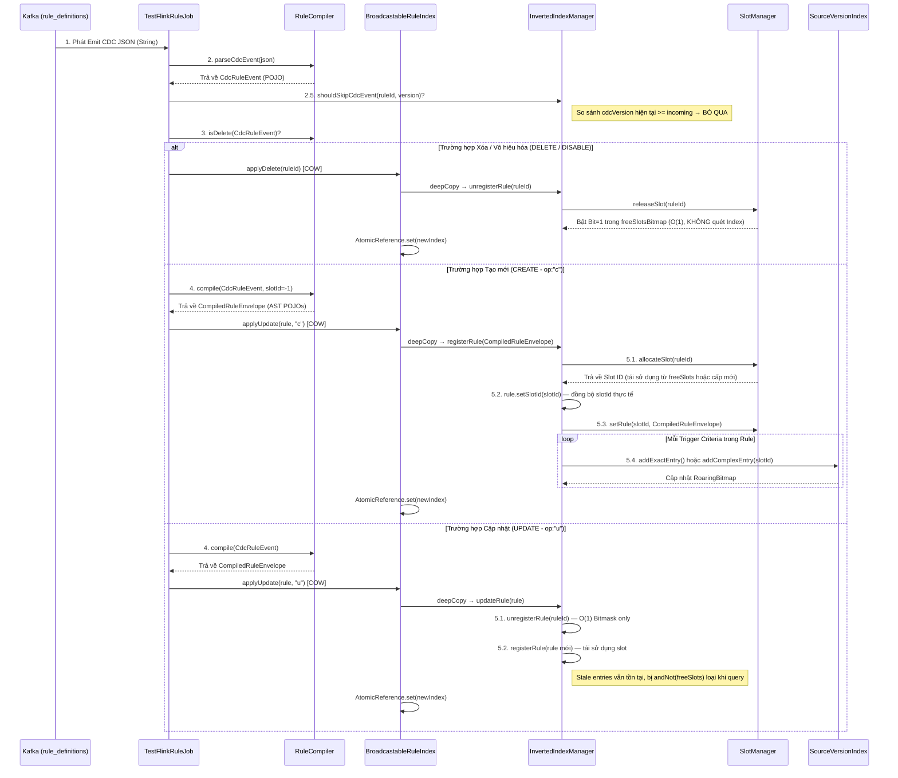
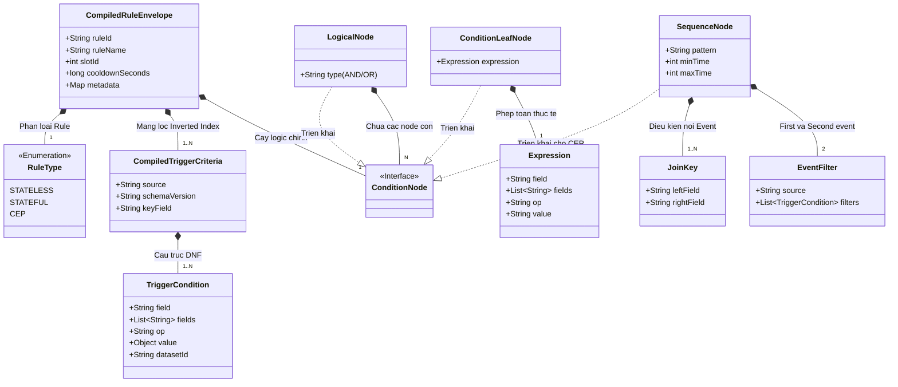

# Luồng xử lý và Tạo Inverted Index cho Rule (Rule Indexing Pipeline)

Tài liệu này mô tả chi tiết vòng đời của một sự kiện cập nhật Rule (Rule Event) từ lúc đi ra khỏi Kafka (dưới dạng chuỗi JSON của Debezium CDC) cho đến khi được biên dịch (Compile) và lưu trữ thành công vào bộ nhớ nén (Inverted Index / RoaringBitmap).

> **Cập nhật lần cuối:** 2026-09-24 — Thêm Version Check, tối ưu updateRule O(1) Bitmask, thêm BroadcastableRuleIndex (COW).

## 1. Sơ đồ kiến trúc tổng quan (Flow Diagram)

## 2. Chi tiết các Class tham gia (Input & Output)

### Bước 1: Thu nhận sự kiện
* **Lớp phụ trách:** `TestFlinkRuleJob` (hoặc các lớp Flink Kafka Source tương tự).
* **Input:** Chuỗi String JSON từ Debezium CDC (`value`).
* **Output:** Truyền chuỗi String này sang `RuleCompiler`.

### Bước 2: Bóc tách lớp vỏ CDC (Envelope Parsing)
* **Lớp phụ trách:** `RuleCompiler`
* **Hàm thực thi:** `parseCdcEvent(String cdcJson)`
* **Input:** Chuỗi String JSON nguyên bản.
* **Logic:** Dùng Jackson bóc các trường cấp 1 của CDC: `rule_id`, `rule_json`, `__op`, `__deleted`, `version`, `enabled`.
* **Output:** Đối tượng `CdcRuleEvent` (Record giữ metadata vòng ngoài, bao gồm `version` để kiểm tra trùng lặp).

### Bước 2.5: Kiểm tra Version (Version Check — Chống duplicate/out-of-order)
* **Lớp phụ trách:** `InvertedIndexManager`
* **Hàm thực thi:** `shouldSkipCdcEvent(String ruleId, long incomingVersion)`
* **Logic:** Tra cứu rule hiện tại bằng `ruleId`. Nếu `existingRule.getCdcVersion() >= incomingVersion` → **BỎ QUA** sự kiện (idempotency). Nếu rule chưa tồn tại hoặc version mới hơn → tiếp tục xử lý.
* **Mục đích:** Chống xử lý trùng lặp khi Kafka replay, hoặc CDC event đến lệch thứ tự.

### Bước 3: Định tuyến logic (Create/Update/Delete)
* **Lớp phụ trách:** `RuleCompiler`
* **Hàm thực thi:** `isDelete(CdcRuleEvent)`
* **Logic:** Kiểm tra trường hợp Rule bị xóa (`__op == "d"`, `__deleted == "true"`, `enabled == false`). Nếu `true`, Flink job bỏ qua khâu dịch và tiến thẳng tới hàm `unregisterRule` của Index. Ngược lại, đi tiếp tới Bước 4.

### Bước 4: Biên dịch AST (Abstract Syntax Tree)
* **Lớp phụ trách:** `RuleCompiler`
* **Hàm thực thi:** `compile(CdcRuleEvent event, int slotId)`
* **Input:** `CdcRuleEvent`.
* **Logic:**
  1. Parse chuỗi `rule_json` lồng bên trong.
  2. Bóc tách và map toàn bộ mảng `trigger_criteria` thành các đối tượng `CompiledTriggerCriteria`.
  3. Duyệt đệ quy (recursive) cây `condition_tree` để tạo cấu trúc Node (`LogicalNode`, `ConditionLeafNode`, `SequenceNode`).
  4. Duyệt cây một lần nữa (hàm `classifyRuleType`) để xác định Rule là loại `STATELESS`, `STATEFUL` hay `CEP`.
* **Output:** `CompiledRuleEnvelope` (Một POJO cực kỳ nặng chứa toàn bộ logic đã được số hóa).

### Bước 5: Cấp phát Slot và Ghi vào Inverted Index
* **Lớp phụ trách:** `InvertedIndexManager`, `SlotManager`, `SourceVersionIndex`
* **Hàm thực thi:** `indexManager.registerRule(CompiledRuleEnvelope)`
* **Input:** `CompiledRuleEnvelope`.
* **Logic luân chuyển nội bộ:**
  1. `InvertedIndexManager` yêu cầu `SlotManager.allocateSlot(ruleId)`.
  2. `SlotManager` tìm trong mảng `freeSlotsBitmap` xem có Slot (Bit) nào trống do Rule khác bị xóa để lại không. Nếu có thì tái sử dụng, nếu không thì cấp phát ID mới (Ví dụ: `slotId = 5`).
  3. **MỚI:** `InvertedIndexManager` gọi `rule.setSlotId(slotId)` để đồng bộ slotId thực tế vào envelope.
  4. `SlotManager` lưu `CompiledRuleEnvelope` vào một mảng `ArrayList` tại vị trí index số 5.
  5. `InvertedIndexManager` duyệt qua từng `CompiledTriggerCriteria` của Rule này.
     - Sinh ra Key phân mảnh theo `source:version` (Vd: `ECOM:v2`).
     - Lấy `SourceVersionIndex` tương ứng.
     - Nếu toán tử là `==`, `IN`, `IN_DATASET`: Gọi `SourceVersionIndex.addExactEntry(field, value, slotId=5)`.
     - Nếu toán tử là `<`, `>`, `CONTAINS`...: Gọi `SourceVersionIndex.addComplexEntry(slotId=5)`.
* **Output:** Cấu trúc BitMap trong RAM được cập nhật (Bật Bit số 5 lên thành `1` tại các Key tương ứng). Không trả về dữ liệu gì cho Flink Job.

### Bước 5b: Cập nhật Rule (updateRule) — Tối ưu O(1) Bitmask
* **Lớp phụ trách:** `InvertedIndexManager`
* **Hàm thực thi:** `indexManager.updateRule(CompiledRuleEnvelope)`
* **Logic (đã tối ưu):**
  1. Gọi `unregisterRule(ruleId)` → Chỉ bật bit trong `freeSlotsBitmap` = O(1). **KHÔNG** quét dọn exactIndex.
  2. Gọi `registerRule(rule)` → Cấp phát slot mới (hoặc tái sử dụng slot vừa giải phóng) = O(K).
  3. Stale entries (rác) từ điều kiện cũ vẫn tồn tại trong exactIndex nhưng sẽ bị loại bỏ tự động bằng `andNot(freeSlotsBitmap)` khi query.
* **Độ phức tạp:** O(1) cho delete + O(K) cho re-register, thay vì O(N) quét tất cả bitmap.
* **Trade-off:** Có thể sinh false positives (stale entries), nhưng `ConditionTreeEvaluator` sẽ loại bỏ chính xác ở bước sau.

### Bước 6: Broadcast Index (BroadcastableRuleIndex — COW)
* **Lớp phụ trách:** `BroadcastableRuleIndex`
* **Mục đích:** Wrap `InvertedIndexManager` bằng `AtomicReference` để broadcast an toàn tới tất cả Flink operator instances.
* **Cơ chế Copy-On-Write:**
  1. Khi có CDC event: `deepCopy()` index hiện tại → sửa đổi trên bản sao → `AtomicReference.set(newIndex)`.
  2. Luồng đọc (event matching) gọi `getIndex()` → đọc lock-free, không bị block.
  3. Luồng ghi (CDC update) gọi `applyUpdate()` hoặc `applyDelete()` → tạo bản sao mới.
* **API chính:**
  - `applyUpdate(rule, op)` — COW register/update
  - `applyDelete(ruleId)` — COW unregister
  - `shouldSkipVersion(ruleId, version)` — kiểm tra version
  - `findCandidateRules(source, version, fields)` — delegate query
  - `getIndex()` — lock-free read

## 3. Cấu trúc các Class trong Package `models` (Data Model)

Tất cả các đối tượng (POJO) sinh ra từ hàm `compile` đều nằm trong package `com.vdf.streaming.models`. Các class này không chứa logic tính toán (hành vi), mà chỉ lưu trữ trạng thái và dữ liệu để chuyển giao cho các tầng xử lý sau (Index và Evaluator).

### Ý nghĩa của các khối chính:
1. **`CompiledRuleEnvelope` (Root):** Là hộp chứa (Envelope) gói toàn bộ thông tin của một Rule. Được `SlotManager` giữ lại và gán cho một `slotId`.
2. **Khối Trigger (`CompiledTriggerCriteria` & `TriggerCondition`):** Đại diện cho mảng `trigger_criteria` trong JSON. Khối này sẽ bị `InvertedIndexManager` "vắt kiệt" để tạo ra các Roaring Bitmap.
3. **Khối Cây logic (`ConditionNode` và các class con):** Đại diện cho khối `condition_tree` trong JSON. Khối này sẽ nằm im lìm trong RAM, cho đến khi có một Event lọt qua được cửa ải Inverted Index, Flink sẽ dùng khối này kết hợp với `ConditionTreeEvaluator` (sắp được code) để phân giải tính đúng/sai.
4. **Khối CEP (`SequenceNode`, `EventFilter`, `JoinKey`):** Là một nhánh cực kỳ đặc biệt của Cây Logic, chuyên dùng để xử lý chuỗi sự kiện (Sequence / NOT_FOLLOWED_BY).

## 4. Tổng kết

Nhờ luồng phân chia tách bạch này:
- **`RuleCompiler`** đóng vai trò là "Thông dịch viên", chuyển đổi từ ngôn ngữ con người (JSON) sang ngôn ngữ máy (POJO, AST).
- **`SlotManager`** đóng vai trò là "Bộ cấp đất", biến chuỗi String RuleID dài thòng thành một con số nguyên (`slotId`) nhỏ gọn để nhét vừa mảng Bit.
- **`SourceVersionIndex`** đóng vai trò là "Sổ cái tra cứu", phân loại các `slotId` vào từng trang sách (`exactIndex`, `complexIndex`) để khi có Event thực tế đến, Flink có thể tra cứu và gộp ứng viên với tốc độ ánh sáng bằng các phép toán Bitwise.
- **`InvertedIndexManager.shouldSkipCdcEvent`** đóng vai trò "Bảo vệ cổng", chặn các CDC event trùng lặp hoặc lỗi thời dựa trên version.
- **`BroadcastableRuleIndex`** đóng vai trò "Nhà phân phối", đảm bảo mọi Flink operator instance đều có bản sao index mới nhất thông qua COW + AtomicReference.
