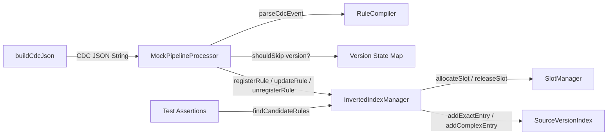

# Kiểm thử Pipeline CDC cho Rule Engine (Mock Test)

> **Cập nhật:** 2026-09-24  
> **File test:** `flink-jobs/src/test/java/com/vdf/streaming/RuleCdcPipelineMockTest.java`  
> **Framework:** JUnit 5 (`junit-jupiter:5.10.2`)  
> **Kết quả:** 24/24 PASS ✅

## 1. Mục tiêu

Kiểm thử toàn bộ pipeline CDC (PostgreSQL → Debezium → Kafka → Flink) **KHÔNG cần infrastructure thật** — chỉ dùng mock CDC JSON events dạng String và kiểm tra hành vi của `RuleCompiler` + `InvertedIndexManager`.

## 2. Kiến trúc Test



### MockPipelineProcessor

Lớp giả lập stateful Flink ProcessFunction:
- Duy trì `Map<String, Long> ruleVersionState` để theo dõi version mỗi rule
- Khi `incomingVersion <= currentVersion` → **bỏ qua** (idempotency)
- Khi delete → `unregisterRule` + xóa version state
- Khi create/update → `compile` + `registerRule` / `updateRule`

```java
private static class MockPipelineProcessor {
    private final RuleCompiler compiler;
    private final InvertedIndexManager indexManager;
    private final Map<String, Long> ruleVersionState = new HashMap<>();
    
    public void process(String cdcJson) {
        CdcRuleEvent event = compiler.parseCdcEvent(cdcJson);
        Long currentVersion = ruleVersionState.get(event.ruleId());
        if (currentVersion != null && event.version() <= currentVersion) return;
        // ... register/update/unregister logic
    }
}
```

### Helper Methods

| Method | Mô tả |
|--------|--------|
| `buildCdcJson(ruleId, name, ruleJson, cooldown, version, enabled, deleted, op)` | Tạo CDC JSON envelope giả lập Debezium output |
| `buildRuleJson(ruleId, name, source, version, field, op, value)` | Tạo rule JSON tối giản với 1 trigger + 1 condition |
| `putValueNode(node, key, value)` | Gán giá trị đa kiểu (String/Int/Boolean/List) vào ObjectNode |

## 3. Danh sách 24 Test Cases

### Group 1: Phân tích Sự kiện CDC & Vòng đời (5 tests)

| # | Test | Mô tả | Assertion |
|---|------|--------|-----------|
| 1 | `testParseCdcCreateEvent` | Parse CDC op="c" | `ruleId == "r1"`, `op == "c"`, `isDelete == false` |
| 2 | `testParseCdcUpdateEvent` | Parse CDC op="u" | `op == "u"`, `isDelete == false` |
| 3 | `testParseCdcDeleteEvent` | Parse CDC op="d" | `isDelete == true` |
| 4 | `testParseCdcDisableEvent` | Parse CDC enabled=false | `isDelete == true` |
| 5 | `testParseCdcDeletedFlagEvent` | Parse CDC __deleted="true" | `isDelete == true` |

### Group 2: Xử lý ngoại lệ về phiên bản — Version Check (5 tests)

| # | Test | Mô tả | Assertion |
|---|------|--------|-----------|
| 6 | `testVersionCheck_NewerVersionAccepted` | v1 → v2 đều được xử lý | `version == 2` |
| 7 | `testVersionCheck_SameVersionSkipped` | v1 → v1 bị skip | `version vẫn == 1` |
| 8 | `testVersionCheck_OlderVersionSkipped` | v3 → v1 bị skip | `version vẫn == 3` |
| 9 | `testVersionCheck_DeleteThenRecreateWithLowerVersion` | Delete → Create v1 | `version == 1` (chấp nhận vì rule đã bị xóa) |
| 10 | `testVersionCheck_RapidUpdatesOnlyLatestWins` | v1,v5,v3,v7,v2 → chỉ 1→5→7 | `version == 7` |

### Group 3: Xóa Inverted Index bằng Bitmask (5 tests)

| # | Test | Mô tả | Assertion |
|---|------|--------|-----------|
| 11 | `testDeleteRule_BitmaskNotScanIndex` | Xóa rule → query không trả về slot đã xóa | `candidates.contains(slotId) == false` |
| 12 | `testDeleteRule_SlotReusedAfterDelete` | Xóa A (slot 0) → tạo B → B nhận slot 0 | `slotA == slotB` |
| 13 | `testDisableRule_TreatedAsDelete` | enabled=false → rule bị unregister | `getRuleById == null` |
| 14 | `testDeleteNonExistentRule_NoError` | Xóa rule ghost → không crash | `assertDoesNotThrow` |
| 15 | `testMultipleDeletesAndAdds_ConsistentState` | 10 add, 5 delete, 5 add → 10 active | `getRuleById != null` cho r5-r14 |

### Group 4: Truy vấn Inverted Index (5 tests)

| # | Test | Mô tả | Assertion |
|---|------|--------|-----------|
| 16 | `testQueryExactMatch_SingleRule` | 1 rule `==`, query khớp | `candidates.contains(slot)` |
| 17 | `testQueryExactMatch_NoMatch` | Query không khớp | `candidates.isEmpty()` |
| 18 | `testQueryComplexOperator_AlwaysCandidate` | Rule `>` → luôn trong candidates | `candidates.contains(slot)` |
| 19 | `testQueryMultipleRules_OnlyMatchingReturned` | 3 rules, event khớp 1 | `cardinality == 1` |
| 20 | `testQueryAfterUpdate_OldConditionNoLongerMatches` | Update điều kiện → cũ = false positive, mới khớp | `candidatesB.contains(slot)` |

> **Lưu ý test #20:** Với bitmask-only update, stale entry cũ vẫn tồn tại (false positive). Đây là hành vi đúng theo spec — Evaluator sẽ loại bỏ ở bước condition_tree evaluation.

### Group 5: Mô phỏng toàn bộ luồng CDC (4 tests)

| # | Test | Mô tả | Assertion |
|---|------|--------|-----------|
| 21 | `testFullPipeline_CreateUpdateDeleteLifecycle` | CREATE → UPDATE → DELETE | Điều kiện mới khớp, delete → empty |
| 22 | `testFullPipeline_BulkCreateAndQuery` | Tạo 50 rules, query từng cái | Mỗi query trả đúng 1 candidate |
| 23 | `testFullPipeline_ConcurrentSourceVersions` | 3 rules từ 3 source:version | Mỗi source:version có đúng 1 rule |
| 24 | `testFullPipeline_DeepCopyForCOW` | DeepCopy → sửa original → copy không bị ảnh hưởng | `copy.find... cardinality == 1` |

## 4. Cách chạy Test

```bash
# Từ thư mục gốc project
/home/tmkhoa1812/.m2/wrapper/dists/apache-maven-3.9.11/a2d47e15/bin/mvn \
    -f flink-jobs/pom.xml \
    test -DskipTests=false \
    -Dtest=com.vdf.streaming.RuleCdcPipelineMockTest

# Hoặc chạy riêng 1 group
/home/tmkhoa1812/.m2/wrapper/dists/apache-maven-3.9.11/a2d47e15/bin/mvn \
    -f flink-jobs/pom.xml \
    test -DskipTests=false \
    -Dtest="com.vdf.streaming.RuleCdcPipelineMockTest\$VersionCheckTests"
```

## 5. Kết quả chạy thực tế

```
Tests run: 5, Failures: 0 -- CdcEventParsingTests
Tests run: 5, Failures: 0 -- VersionCheckTests  
Tests run: 5, Failures: 0 -- InvertedIndexDeletionTests
Tests run: 5, Failures: 0 -- IndexQueryTests
Tests run: 4, Failures: 0 -- FullPipelineTests
─────────────────────────────────────────────────
Tests run: 24, Failures: 0, Errors: 0, Skipped: 0
BUILD SUCCESS
```
